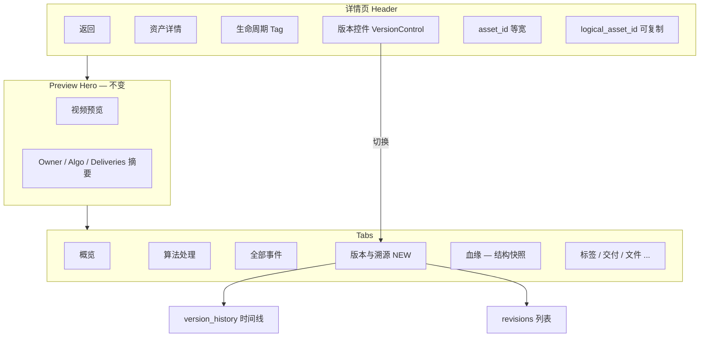

# 资产版本与溯源 — UI 设计规范（Figma / 线框 / 视觉）

| 字段 | 值 |
|------|-----|
| 状态 | **Design spec**（待 Figma 落稿 + 分阶段实现）|
| 关联 Linear | CYB-1017（已 ship 最小 Select）→ 本文档为 **CYB-1017-ui** 增强 |
| API 真源 | `GET /api/v1/assets/{id}/provenance`（`revisions`, `version_history`, `lineage`）|
| 参考竞品 | OpenMetadata Entity Detail（版本 + 血缘 Tab）、Dagster Asset 详情 |
| 平台设计系统 | [`docs/archive/frontend/frontend-design-reference.md`](../../../archive/frontend/frontend-design-reference.md) §四 |
| 实现现状 | `AssetVersionSelect`（header `Select` only）；概览 Tab 仍显示 legacy `version` 字段 |

---

## 1. 设计目标

| 用户 | 任务 | 成功标准 |
|------|------|----------|
| 运营 / 数据 PM | 确认「当前给客户的是哪一版」| 一眼看到 **当前版** + logical 族 ID |
| 运营 | 回溯 v1→v2 为何升级 | **升级原因**（`reason`）、**触发 run**（`by_run_id`）可读 |
| 工程师 | 对比两版差异 | 能切换 revision，概览字段随版变化（segment / mcap 等）|
| 合规 / 交付 | 证明未静默覆盖 | 非 current 版本有 **历史只读** 视觉态；URL 绑定 `asset_id` |

**非目标（本文档 P2+）**：ReactFlow 全图血缘（沿用现有「血缘」Tab）；`GET /logical-assets/{id}/current` 跳转页。

---

## 2. 信息架构



**Tab 决策**：新增 **「版本与溯源」**（`key=versions`），避免挤在概览里；Header 保留 **快速切换**（OpenMetadata 模式：顶栏版本 + 专 Tab 深读）。

---

## 3. 线框图（Wireframes）

### 3.1 详情页 Header — 多版本资产（≥2 revisions）

```
┌──────────────────────────────────────────────────────────────────────────────┐
│ [←]  资产详情   [created]   ┌─────────────────────────┐   9KnuP7F3          │
│                              │ 版本  v2 ▾  ● 当前       │   logical azVJuXga 📋│
│                              └─────────────────────────┘                      │
└──────────────────────────────────────────────────────────────────────────────┘
```

**交互**

- 控件类型：**Segmented 式下拉**（非裸 `Select`），左侧标签「版本」，右侧当前值。
- 打开面板：列表每项 = `v{n}` + 副标题 `asset_id` 后 4 位 + 时间 + 当前角标。
- 选 v1 → 路由 `/assets/azVJuXga`；顶栏与概览同步刷新。
- `logical_asset_id`：次要文字 + 复制按钮（`Typography.Paragraph copyable`）。

### 3.2 详情页 Header — 单版本（隐藏或降级）

```
┌──────────────────────────────────────────────────────────────────────────────┐
│ [←]  资产详情   [created]   v1 · 仅一版          uF4pXWKY   logical uF4pXWKY 📋│
└──────────────────────────────────────────────────────────────────────────────┘
```

不显示下拉；静态文案 `v1 · 仅一版`（`font-size: 12px`, `color: token.colorTextSecondary`）。

### 3.3 查看历史版本（非 current）— 横幅

```
┌──────────────────────────────────────────────────────────────────────────────┐
│ ⓘ  你正在查看历史版本 v1（非当前）。当前有效版本为 v2 → [跳转到当前版]              │
└──────────────────────────────────────────────────────────────────────────────┘
│ ... Preview Hero ...                                                          │
```

- 背景：`#FFFBEB`（warning 浅底）；边框：`1px #FCD34D`。
- 主按钮：link 样式跳转 `revisions.find(is_current).asset_id`。

### 3.4 新 Tab「版本与溯源」

```
┌─ 版本与溯源 ─────────────────────────────────────────────────────────────────┐
│                                                                               │
│  逻辑资产 ID    azVJuXga                                    [复制]             │
│  当前版本       v2 → 9KnuP7F3                                                 │
│                                                                               │
│  ── 版本链（纵向）──────────────────────────────────────────────────────────  │
│                                                                               │
│    ● v2  当前   9KnuP7F3   2026-05-22 15:33:55                                │
│    │         升级原因: algo rerun                                             │
│    │         触发 run: run-99  [打开 run →]                                    │
│    │                                                                          │
│    ○ v1        azVJuXga   2026-05-22 15:33:54   [查看此版]                     │
│                                                                               │
│  ── 与上一版差异（v2 vs v1）────────────────── 仅当 n>1 且 API 可 diff 时 ──  │
│  │ segment_locator   变更                                                     │
│  │ mcap_file_id       XcpGBPMZ → X58VUBmD                                     │
│  │ start_timestamp_ns  变更                                                   │
│                                                                               │
│  ── 结构血缘（摘要）──────────────────────────── [在「血缘」Tab 查看完整] ──    │
│  │ 上游: MCAP XcpGBPMZ                                                        │
│  │ 下游: 6 个算法 · 0 交付                                                    │
│                                                                               │
└───────────────────────────────────────────────────────────────────────────────┘
```

**时间线数据源**：`version_history[]`（按 `version` 升序）；节点样式见 §5.3。

### 3.5 版本下拉面板（Dropdown overlay）

```
┌──────────────────────────────┐
│ 选择资产版本                  │
├──────────────────────────────┤
│ ● v2  当前                    │
│     9KnuP7F3 · 05-22 15:33   │
├──────────────────────────────┤
│ ○ v1                        │
│     azVJuXga · 05-22 15:33   │
└──────────────────────────────┘
```

宽度 **280px**；当前项左侧 **4px 蓝色指示条**（`#2563EB`）。

### 3.6 概览 Tab 字段修正（与 Header 一致）

| 标签 | 数据源 | 说明 |
|------|--------|------|
| 资产版本 `revision` | `asset.revision` | 替换 legacy `version` |
| 是否当前 | `asset.is_current` | Tag：当前 / 历史 |
| 逻辑资产 ID | `asset.logical_asset_id` | 等宽 + 复制 |

---

## 4. 视觉规范（Visual Spec）

与平台 [`frontend-design-reference.md`](../../../archive/frontend/frontend-design-reference.md) **对齐**；Figma 用 **Variables** 绑定下列 token。

### 4.1 颜色（Figma Variables / CSS）

| Token | Hex | 用途 |
|-------|-----|------|
| `color.primary` | `#2563EB` | 当前版本指示条、主按钮 |
| `color.text` | `#1E293B` | 标题、版本号 |
| `color.textSecondary` | `#64748B` | logical id、时间戳 |
| `color.bgLayout` | `#F8FAFC` | 页面底（已有）|
| `color.versionCurrent` | `#2563EB` | 当前版圆点 / 描边 |
| `color.versionHistory` | `#94A3B8` | 历史版时间线节点 |
| `color.bannerHistory` | `#FFFBEB` | 非 current 横幅背景 |
| `color.border` | `#E2E8F0` | 卡片、时间线连接线 |

### 4.2 字体

| 样式名 | 字体 | 大小 | 行高 | 字重 |
|--------|------|------|------|------|
| `Heading/DetailTitle` | Inter | 20px | 28px | 600 |
| `Version/Label` | Inter | 12px | 20px | 500 |
| `Version/Value` | Inter | 14px | 22px | 600 |
| `Version/Meta` | Fira Code | 12px | 20px | 400 |
| `Timeline/Title` | Inter | 14px | 22px | 500 |
| `Timeline/Body` | Inter | 13px | 20px | 400 |

### 4.3 间距与圆角

| 元素 | 值 |
|------|-----|
| Header 控件 gap | 12px（与现 `gap-3` 一致）|
| VersionControl 高度 | 32px（Ant `size="small"`）|
| VersionControl min-width | 160px（现 140 → 160）|
| Tab「版本与溯源」内容 padding | 16px |
| 时间线节点间距 | 24px vertical |
| 卡片圆角 | 8px |
| 下拉面板圆角 | 8px；阴影 elevation-2 |

### 4.4 组件状态

| 状态 | 表现 |
|------|------|
| Default | 显示当前 `revision` + `● 当前` |
| Hover（下拉项）| 背景 `#F1F5F9` |
| Selected | 左侧 4px `color.primary` 条 |
| Disabled | 仅一版：无下拉，静态文案 |
| Loading provenance | Header 控件 Skeleton 80×32 |
| Error provenance | 控件隐藏；Tooltip「版本信息加载失败」|

### 4.5 图标（Ant Design Icons）

| 场景 | 图标 |
|------|------|
| 版本 Tab | `HistoryOutlined` 或 `BranchesOutlined` |
| 复制 logical id | `CopyOutlined` |
| 历史横幅 | `InfoCircleOutlined` |
| 跳转 run | `LinkOutlined`（外链 algo run 详情，P1.5）|

---

## 5. Figma 文件结构（交付清单）

在 Figma 创建文件：**`DataBrew / Asset Detail — Version & Provenance`**

### 5.1 Pages

| Page | 内容 |
|------|------|
| `00 — Cover` | 链接本文档、CYB-1017、API 样例 JSON |
| `01 — Wireframes` | §3 全部线框，Desktop 1440×900 |
| `02 — Components` | 组件库（见下）|
| `03 — Screens` | 高保真：多版本 / 单版本 / 历史横幅 / 版本 Tab |
| `04 — Specs` | 标注页：间距、颜色 Variables、交互说明 |
| `05 — Prototype` | 连线：下拉切换 → 路由变化 → 横幅出现 |

### 5.2 Components（Figma Components + Variants）

| 组件名 | Variants | 说明 |
|--------|----------|------|
| `VersionControl` | `state=default\|open\|loading\|single` | Header 下拉 |
| `VersionDropdownItem` | `current=true\|false` | 面板行 |
| `VersionHistoryBanner` | `—` | 非 current 顶栏警告 |
| `VersionTimelineNode` | `current=true\|false` | Tab 内纵向节点 |
| `LogicalAssetId` | `size=sm\|md` | 可复制 ID 行 |

**Auto-layout**：所有列表项纵向 `gap=8`；Header 横向 `gap=12`，align center。

### 5.3 时间线节点规范

```
当前版 (current):
  ● 实心圆 10px  fill #2563EB
  竖线      2px   #E2E8F0 连接下一节点

历史版:
  ○ 空心圆 10px  stroke #94A3B8 2px
```

---

## 6. 交互说明（Interaction Spec）

| # | 触发 | 行为 | 路由/API |
|---|------|------|----------|
| I1 | 进入详情 | 并行 `GET /assets/{id}` + `GET /provenance` | 已有 |
| I2 | provenance.revisions.length ≤ 1 | 不渲染 `VersionControl` 下拉 | — |
| I3 | 切换版本 | `navigate(/assets/{next})`，`replace: false` | 保留 returnTo state |
| I4 | 当前页 revision 非 current | 显示 `VersionHistoryBanner` | 从 provenance 算 |
| I5 | 点击「跳转到当前版」| navigate 到 `is_current` 的 asset_id | — |
| I6 | 打开「版本与溯源」Tab | 只读展示 timeline；不重复请求若 provenance 已缓存 | — |
| I7 | 点击「查看此版」| 同 I3 | — |
| I8 | 复制 logical_asset_id | 写入剪贴板 + toast | — |

**键盘**：VersionControl 聚焦 → ArrowDown 打开 → Enter 选中 → Esc 关闭。

---

## 7. 与 API 字段映射

| UI 标签 | JSON 路径 |
|---------|-----------|
| v{n} | `revisions[].revision` |
| 当前 | `revisions[].is_current` |
| asset_id 行 | `revisions[].asset_id` |
| 升级时间 | `version_history[].promoted_at` |
| 原因 | `version_history[].reason` |
| run | `version_history[].by_run_id` |
| logical | `provenance.logical_asset_id` |
| 概览「资产版本」| `GET /assets/{id}` → `revision`, `is_current`, `logical_asset_id` |

**禁止**：概览 Tab 继续用 legacy `asset.version`（与 `revision` 不一致的根因）。

---

## 8. 实施分期（对齐工程）

| 阶段 | 范围 | 估时 |
|------|------|------|
| **P0 抛光**（建议紧跟 1017）| `VersionControl` 替换裸 Select；概览字段改 `revision`；非 current 横幅 | 0.5–1d |
| **P1** | 新 Tab `VersionProvenanceTab` + 时间线 + logical 复制 | 1–2d |
| **P1.5** | `by_run_id` 链到 algo run 详情（若路由存在）| 0.5d |
| **P2** | v(n) vs v(n-1) 字段 diff（需后端或前端对比两版 GET asset）| 2d |
| **P2+** | OpenLineage 风格图（[`openlineage-integration.md`](openlineage-integration.md)）| 另开 epic |

---

## 9. 验收标准（设计 QA）

- [ ] Figma `03 — Screens` 含 4 态：多版本当前 / 多版本历史 / 单版本 / provenance 加载失败
- [ ] Header 在 1440 宽度下不换行（logical id 过长 truncate + tooltip）
- [ ] 切换 v1→v2 后概览 `revision` 与 Header 一致
- [ ] 非 current 横幅仅历史版出现，跳转后消失
- [ ] 「版本与溯源」Tab 在 `version_history` 为空时仍显示 revisions 列表
- [ ] 色板与 `frontend-design-reference` §四 一致（Primary `#2563EB`）
- [ ] a11y：VersionControl `aria-label="资产版本"`；横幅 `role="status"`

---

## 10. 附录：Figma 导出与 dev 对接

| 产出 | 路径 / 动作 |
|------|-------------|
| 设计稿 | Figma 链接填到 Linear CYB-1017 评论 |
| Dev Mode | 组件标注 spacing / color variable |
| 代码目录建议 | `Frontend/src/components/asset-detail/VersionControl.tsx`、`VersionProvenanceTab.tsx`、`VersionHistoryBanner.tsx` |
| OpenSpec | 在 `CYB-1017` 或新 change `CYB-1017-ui-polish` 引用本文档 |

**样例数据（Figma 用）**：见 `docs/review/api-guide.md` §1.7 `provenance` 响应；dev 资产 `9KnuP7F3` / `azVJuXga`（logical `azVJuXga`）。

---

## 修订记录

| 日期 | 作者 | 说明 |
|------|------|------|
| 2026-05-22 | Agent | 初版：线框 + 视觉 + Figma 结构；基于 CYB-1017 已部署 API 与现 UI 差距 |
