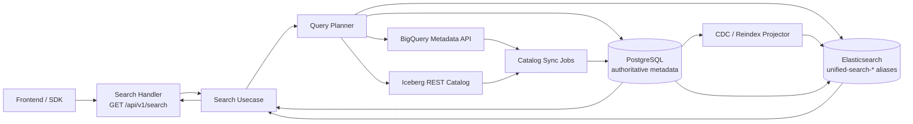
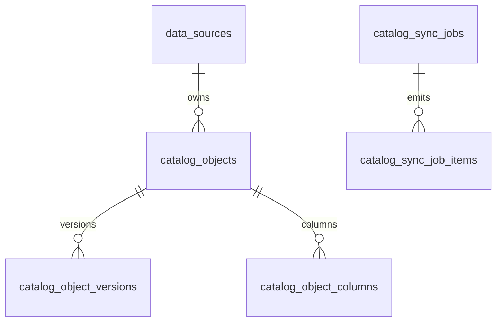

# 统一检索增强设计

> 目标：在现有 Elasticsearch 资产搜索与 CYB-1098 血缘查询基础上，形成覆盖资产、血缘关系、外部数据源 Catalog 与未来语义检索的统一检索服务。本文是设计文档，不代表所有 API 已上线。

## 1. 背景与范围

cyber-databrew 当前是 Data+AI 资产平台，运行时技术栈为 Go 1.25 + Gin + PostgreSQL + Elasticsearch + BigQuery(BigLake Iceberg)，代码架构遵循 `handler -> usecase -> repository`。搜索相关现状如下：

- Elasticsearch 已用于资产元信息全文检索与属性过滤，索引文档以 `asset_id` 为主键。
- 资产血缘查询已通过 CYB-1098 上线，入口为 `GET /api/v1/audit/lineage-search`，数据源是 PostgreSQL `asset_relations`。
- `asset_relations` 尚未投影到 Elasticsearch，统一搜索无法直接按血缘召回。
- 外部数据源对象，例如 BigQuery dataset/table、Iceberg table，尚未纳入统一 Catalog。
- 当前检索主要是 lexical search，无向量召回与语义排序能力。
- 现行主路径文档中，工作台查询以 `POST /api/v1/queries/run` 为主；本文设计的 `GET /api/v1/search` 是面向统一检索体验的目标态薄封装，可在内部复用 Query IR planner。

### 1.1 设计目标

| 目标 | 说明 |
| --- | --- |
| 统一召回 | 同一个检索入口可搜索 DataBrew 资产、Catalog 外部对象，并可用血缘过滤扩展召回。 |
| 血缘可检索 | 将 `asset_relations` 投影到 ES，使“某资产相关资产”“上游/下游资产”成为搜索条件，而不是独立审计查询。 |
| Catalog 纳管 | 建立 DataSource 与 CatalogObject 模型，支持 BigQuery 与 Iceberg 元数据发现、同步、跨源搜索。 |
| 体验增强 | 支持 facet、typeahead、日期/数值 range、高级排序、结果解释。 |
| 平滑演进 | 从纯文本 + filter 过渡到文本 + 向量混合搜索，保持 API 和索引可兼容演进。 |

### 1.2 非目标

- 不在搜索服务中执行 BigQuery 数据行级查询；统一检索只搜索元数据与统计摘要。
- 不把 ES 作为权威业务库；PG 仍是事实源，ES 可以通过 reindex 重建。
- 不用 ES join 实时追血缘全图；血缘投影用于检索召回，深度遍历仍以 PG recursive CTE 或离线闭包表为准。
- 不在第一阶段引入独立向量数据库；优先评估 Elasticsearch dense vector / kNN。

## 2. 现状分析

### 2.1 当前搜索能力清单

| 能力 | 当前状态 | 主要数据源 | 备注 |
| --- | --- | --- | --- |
| 资产 ID / 名称 / 类型搜索 | 已具备基础能力 | ES `assets` index + PG refine | 文档中历史 `/search/assets` 与 Query IR 路径并存，目标态需统一。 |
| 标签过滤 | 已具备基础能力 | `asset_tags` -> ES `tags` / `tags_flat` | `tags` 支持 nested，`tags_flat` 支持简单等值。 |
| 生命周期状态过滤 | 已具备基础能力 | `assets.lifecycle_state` -> ES | `status` 作为 legacy 字段保留。 |
| 算法状态 / 动作标注投影 | 部分具备 | `asset_algo_latest` / actions -> ES nested | 适合后续纳入统一 facet。 |
| 血缘查询 | 已上线独立端点 | PG `asset_relations` | `GET /api/v1/audit/lineage-search`，不参与 ES 搜索。 |
| 搜索索引运维 | 已具备 | `/search/sync-status`、admin reindex | 支持 ES / PG 对账与重建。 |
| 外部源元数据检索 | 未纳管 | BigQuery / Iceberg | 目前只有 lakehouse 查询能力，不是统一 Catalog。 |
| 语义检索 | 未具备 | 无 | 无 embedding 生成、向量索引与混合排序。 |

### 2.2 主要痛点

1. **不能把血缘作为搜索条件**
   - 用户可以查某资产血缘，但不能在资产搜索页里直接过滤“上游包含 dataset A 的资产”。
   - 血缘结果和资产搜索结果是两个协议，前端需要二次拼装。

2. **不能跨外部数据源检索**
   - BigQuery dataset/table、Iceberg table 不是平台资产，不进入 ES。
   - 外部表 schema、owner、描述、行数、更新时间等元数据无法与 DataBrew 资产统一检索。

3. **纯文本检索缺少语义能力**
   - 用户搜索“可用于重算的高速场景数据”时，关键词必须命中具体 tag 或 notes。
   - 同义词、领域语义、描述相似、schema 相似等场景召回不足。

4. **搜索体验偏基础**
   - 缺少 facet 聚合、typeahead、高级 range filter、排序选项与结果解释。
   - API 参数没有统一承载 lineage filter 与 data source filter。

## 3. 总体架构



### 3.1 技术决策

| 决策 | 结论 | 理由 |
| --- | --- | --- |
| 统一搜索入口 | 新增目标态 `GET /api/v1/search`，内部可编译为 Query IR | 保持工作台 Query IR 能力，同时给前端搜索框提供简单 GET 协议。 |
| 搜索文档形态 | 使用统一索引别名，文档带 `entity_kind` | 同一查询可返回 asset、catalog_object、lineage_edge 等不同实体。 |
| 血缘索引策略 | 资产文档内反范式直接邻接关系，另建 edge 文档支持边搜索 | 邻接关系满足常见过滤，edge 文档支持关系本身检索与 reindex 对账。 |
| Catalog 权威源 | PG 保存 DataSource / CatalogObject 元数据，外部系统为发现源 | 防止 UI 搜索直接依赖 BigQuery / Iceberg 实时可用性。 |
| ES 可靠性 | ES 仅为派生索引，所有文档可从 PG + 外部元数据同步状态重建 | 符合项目“衍生引擎可丢可重建”的原则。 |
| 向量引入 | 先在 ES 中增量加入 `embedding` 字段，后续按流量切混合召回 | 避免第一阶段引入新基础设施。 |

### 3.2 索引组织

建议保留现有 `assets` index 的兼容 alias，同时新增统一检索 alias：

| Alias | 后端实际索引 | 用途 |
| --- | --- | --- |
| `assets` | `assets-vN` | 现有资产搜索兼容。 |
| `unified-search-read` | `assets-vN`, `catalog-objects-vN`, `lineage-edges-vN` | 统一搜索读别名。 |
| `unified-search-write-assets` | `assets-vN` | 资产 projector 写入。 |
| `unified-search-write-catalog` | `catalog-objects-vN` | Catalog sync 写入。 |
| `unified-search-write-lineage` | `lineage-edges-vN` | 血缘 projector 写入。 |

多 index alias 的好处是不同实体 mapping 可以独立演进，查询层通过 `entity_kind` 和 `_index` 归一化结果。

## 4. 血缘纳入搜索

### 4.1 源数据模型

`asset_relations` 表表达复杂血缘：

| 字段 | 说明 |
| --- | --- |
| `parent_asset_id` | 上游/父资产 ID。 |
| `child_asset_id` | 下游/子资产 ID。 |
| `relation_type` | `split_from`、`derived_from`、`contains`、`sampled_from`、`merged_from`、`revision_of`。 |
| `method` | 生成方式，例如 `clip`、`merge`、`manual`、`pipeline`。 |
| `algo_name` / `algo_version` | 算法派生来源。 |
| `run_id` | pipeline / algo run ID。 |
| `parent_start_offset_ms` / `parent_end_offset_ms` | 父资产中的时间范围。 |
| `created_at` | 关系创建时间。 |

语义约定：

- `upstream`：从 `child_asset_id = seed` 反查 `parent_asset_id`。
- `downstream`：从 `parent_asset_id = seed` 正查 `child_asset_id`。
- 默认关系类型只包含 dependency / structural lineage：`split_from, derived_from, contains, sampled_from, merged_from`。
- `revision_of` 代表版本关系，默认不混入依赖血缘，除非客户端显式传入。

### 4.2 ES 映射设计

#### 4.2.1 资产文档增强

在 `assets-vN` 中增加邻接关系投影，满足“搜资产时按直接上下游过滤”的高频场景。

```json
{
  "mappings": {
    "properties": {
      "entity_kind": { "type": "constant_keyword", "value": "asset" },
      "lineage": {
        "properties": {
          "upstream_asset_ids": { "type": "keyword" },
          "downstream_asset_ids": { "type": "keyword" },
          "upstream_count": { "type": "integer" },
          "downstream_count": { "type": "integer" },
          "relation_types": { "type": "keyword" },
          "has_lineage": { "type": "boolean" },
          "last_relation_at": { "type": "date" },
          "edges": {
            "type": "nested",
            "properties": {
              "direction": { "type": "keyword" },
              "related_asset_id": { "type": "keyword" },
              "relation_type": { "type": "keyword" },
              "method": { "type": "keyword" },
              "algo_name": { "type": "keyword" },
              "algo_version": { "type": "keyword" },
              "run_id": { "type": "keyword" },
              "parent_start_offset_ms": { "type": "long" },
              "parent_end_offset_ms": { "type": "long" },
              "created_at": { "type": "date" }
            }
          }
        }
      }
    }
  }
}
```

写入策略：

- 任意 `asset_relations` 变更后，projector 重建两端资产文档的 `lineage` 投影。
- 对高出度资产设置截断阈值，例如 `lineage.edges` 最多 200 条；完整深度遍历仍走 PG。
- `upstream_asset_ids` / `downstream_asset_ids` 用于 term filter，`lineage.edges` 用于 relation_type/method/algo 组合过滤。

#### 4.2.2 血缘边文档索引

新增 `lineage-edges-vN`，每条 relation 一条文档，用于搜索关系本身、typeahead、对账与 future graph explain。

```json
{
  "settings": {
    "number_of_shards": 1,
    "number_of_replicas": 1
  },
  "mappings": {
    "properties": {
      "entity_kind": { "type": "constant_keyword", "value": "lineage_edge" },
      "edge_id": { "type": "keyword" },
      "parent_asset_id": { "type": "keyword" },
      "child_asset_id": { "type": "keyword" },
      "relation_type": { "type": "keyword" },
      "method": { "type": "keyword" },
      "algo_name": {
        "type": "keyword",
        "fields": { "text": { "type": "text" } }
      },
      "algo_version": { "type": "keyword" },
      "run_id": { "type": "keyword" },
      "parent_start_offset_ms": { "type": "long" },
      "parent_end_offset_ms": { "type": "long" },
      "created_at": { "type": "date" },
      "parent_asset": {
        "properties": {
          "name": { "type": "text", "fields": { "keyword": { "type": "keyword" } } },
          "asset_type": { "type": "keyword" },
          "lifecycle_state": { "type": "keyword" },
          "tags_flat": { "type": "flattened" }
        }
      },
      "child_asset": {
        "properties": {
          "name": { "type": "text", "fields": { "keyword": { "type": "keyword" } } },
          "asset_type": { "type": "keyword" },
          "lifecycle_state": { "type": "keyword" },
          "tags_flat": { "type": "flattened" }
        }
      }
    }
  }
}
```

`edge_id` 建议为稳定哈希：

```text
sha256(parent_asset_id + "\x1f" + child_asset_id + "\x1f" + relation_type)
```

### 4.3 血缘搜索 API 增强

`GET /api/v1/search` 增加 lineage filter：

| 参数 | 示例 | 说明 |
| --- | --- | --- |
| `lineage_asset_id` | `asset_seg_001` | 血缘种子资产。 |
| `lineage_direction` | `upstream` / `downstream` / `both` | 默认 `both`。 |
| `lineage_depth` | `1` / `2` / `3` | 默认 `1`；`>1` 时先用 PG/闭包计算候选 ID，再交给 ES 搜索 refine。 |
| `lineage_relation_types` | `derived_from,merged_from` | 逗号分隔；默认 dependency relation set。 |
| `include_lineage` | `true` | 结果中返回匹配到的 relation 摘要。 |

执行策略：

1. `depth = 1`：直接用 ES `lineage.upstream_asset_ids` / `lineage.downstream_asset_ids` term filter。
2. `depth > 1`：调用 lineage repository 通过 PG recursive CTE 计算候选 asset IDs；ES 查询增加 `terms asset_id IN (...)`。
3. 候选数量超过阈值，例如 10,000，返回 `400 LINEAGE_FILTER_TOO_BROAD`，提示缩小 relation type、depth 或增加关键词。
4. `include_lineage=true` 时，返回命中的直接边摘要；深度路径解释可以异步或单独调用 `/audit/lineage-search`。

示例 ES 查询片段：

```json
{
  "query": {
    "bool": {
      "must": [
        { "multi_match": { "query": "高速 场景", "fields": ["name^3", "notes", "owner.text", "tags.value"] } }
      ],
      "filter": [
        { "term": { "entity_kind": "asset" } },
        { "term": { "lineage.upstream_asset_ids": "dataset_2026_q2" } },
        { "term": { "lineage.relation_types": "derived_from" } }
      ]
    }
  }
}
```

## 5. 数据源纳管（Catalog）

### 5.1 DataSource 概念

DataSource 是对外部元数据源的连接定义与同步边界。CatalogObject 是从 DataSource 发现并注册的平台中立对象。



支持对象：

| Provider | DataSource 类型 | CatalogObject 类型 | 说明 |
| --- | --- | --- | --- |
| BigQuery | `bigquery` | `bigquery_dataset`, `bigquery_table`, `bigquery_view` | 通过 project/dataset/table 发现。 |
| BigLake Iceberg | `iceberg` | `iceberg_namespace`, `iceberg_table` | 通过 BigLake REST Catalog / Iceberg REST Catalog 发现。 |
| DataBrew | `databrew` | `asset` | 平台内部资产，用于统一结果归一化，不重复存储资产事实。 |

### 5.2 PostgreSQL schema 设计

#### 5.2.1 `data_sources`

```sql
CREATE TABLE data_sources (
    data_source_id      TEXT PRIMARY KEY,
    name                TEXT NOT NULL,
    provider            TEXT NOT NULL CHECK (provider IN ('bigquery', 'iceberg', 'databrew')),
    connection_type     TEXT NOT NULL,
    project_id          TEXT,
    location            TEXT,
    catalog_name        TEXT,
    default_namespace   TEXT,
    credentials_ref     TEXT,
    config              JSONB NOT NULL DEFAULT '{}'::jsonb,
    status              TEXT NOT NULL DEFAULT 'active'
        CHECK (status IN ('active', 'paused', 'error', 'deleted')),
    sync_mode           TEXT NOT NULL DEFAULT 'manual'
        CHECK (sync_mode IN ('manual', 'scheduled', 'event')),
    sync_interval_sec   INTEGER,
    last_sync_at        TIMESTAMPTZ,
    last_sync_status    TEXT,
    last_sync_error     TEXT,
    created_by          TEXT,
    created_at          TIMESTAMPTZ NOT NULL DEFAULT now(),
    updated_at          TIMESTAMPTZ NOT NULL DEFAULT now()
);

CREATE UNIQUE INDEX idx_data_sources_provider_name
    ON data_sources(provider, name)
    WHERE status <> 'deleted';
```

#### 5.2.2 `catalog_objects`

```sql
CREATE TABLE catalog_objects (
    object_id           TEXT PRIMARY KEY,
    data_source_id      TEXT NOT NULL REFERENCES data_sources(data_source_id),
    provider            TEXT NOT NULL,
    object_type         TEXT NOT NULL,
    catalog_name        TEXT,
    namespace           TEXT NOT NULL,
    object_name         TEXT NOT NULL,
    display_name        TEXT,
    description         TEXT,
    owner               TEXT,
    format              TEXT,
    storage_uri         TEXT,
    external_ref        TEXT NOT NULL,
    schema_hash         TEXT,
    row_count           BIGINT,
    size_bytes          BIGINT,
    partition_spec      JSONB NOT NULL DEFAULT '{}'::jsonb,
    properties          JSONB NOT NULL DEFAULT '{}'::jsonb,
    tags                JSONB NOT NULL DEFAULT '{}'::jsonb,
    status              TEXT NOT NULL DEFAULT 'active'
        CHECK (status IN ('active', 'stale', 'missing', 'deleted')),
    discovered_at       TIMESTAMPTZ NOT NULL DEFAULT now(),
    last_synced_at      TIMESTAMPTZ,
    created_at          TIMESTAMPTZ NOT NULL DEFAULT now(),
    updated_at          TIMESTAMPTZ NOT NULL DEFAULT now(),
    UNIQUE (data_source_id, external_ref)
);

CREATE INDEX idx_catalog_objects_lookup
    ON catalog_objects(provider, object_type, namespace, object_name);

CREATE INDEX idx_catalog_objects_data_source
    ON catalog_objects(data_source_id, status, updated_at DESC);
```

#### 5.2.3 `catalog_object_columns`

```sql
CREATE TABLE catalog_object_columns (
    column_id           TEXT PRIMARY KEY,
    object_id           TEXT NOT NULL REFERENCES catalog_objects(object_id) ON DELETE CASCADE,
    column_name         TEXT NOT NULL,
    ordinal_position    INTEGER NOT NULL,
    data_type           TEXT NOT NULL,
    mode                TEXT,
    description         TEXT,
    policy_tags         TEXT[],
    is_partition_key    BOOLEAN NOT NULL DEFAULT false,
    is_clustering_key   BOOLEAN NOT NULL DEFAULT false,
    stats               JSONB NOT NULL DEFAULT '{}'::jsonb,
    created_at          TIMESTAMPTZ NOT NULL DEFAULT now(),
    updated_at          TIMESTAMPTZ NOT NULL DEFAULT now(),
    UNIQUE (object_id, column_name)
);

CREATE INDEX idx_catalog_columns_name
    ON catalog_object_columns(column_name);
```

#### 5.2.4 `catalog_object_versions`

```sql
CREATE TABLE catalog_object_versions (
    object_version_id   TEXT PRIMARY KEY,
    object_id           TEXT NOT NULL REFERENCES catalog_objects(object_id) ON DELETE CASCADE,
    version_ref         TEXT NOT NULL,
    version_type        TEXT NOT NULL CHECK (version_type IN ('snapshot_id', 'etag', 'last_modified', 'manual')),
    schema_ref          TEXT,
    manifest_uri        TEXT,
    row_count           BIGINT,
    size_bytes          BIGINT,
    checksum            TEXT,
    properties          JSONB NOT NULL DEFAULT '{}'::jsonb,
    created_by          TEXT,
    created_at          TIMESTAMPTZ NOT NULL DEFAULT now(),
    UNIQUE (object_id, version_ref)
);
```

#### 5.2.5 `catalog_sync_jobs`

```sql
CREATE TABLE catalog_sync_jobs (
    sync_job_id         TEXT PRIMARY KEY,
    data_source_id      TEXT NOT NULL REFERENCES data_sources(data_source_id),
    status              TEXT NOT NULL CHECK (status IN ('queued', 'running', 'succeeded', 'failed', 'cancelled')),
    trigger_type        TEXT NOT NULL CHECK (trigger_type IN ('manual', 'scheduled', 'api')),
    started_at          TIMESTAMPTZ,
    finished_at         TIMESTAMPTZ,
    objects_seen        INTEGER NOT NULL DEFAULT 0,
    objects_upserted    INTEGER NOT NULL DEFAULT 0,
    objects_deleted     INTEGER NOT NULL DEFAULT 0,
    error               TEXT,
    created_at          TIMESTAMPTZ NOT NULL DEFAULT now()
);
```

### 5.3 Catalog ES mapping

新增 `catalog-objects-vN`：

```json
{
  "mappings": {
    "properties": {
      "entity_kind": { "type": "constant_keyword", "value": "catalog_object" },
      "object_id": { "type": "keyword" },
      "data_source_id": { "type": "keyword" },
      "data_source_name": {
        "type": "keyword",
        "fields": { "text": { "type": "text" } }
      },
      "provider": { "type": "keyword" },
      "object_type": { "type": "keyword" },
      "catalog_name": { "type": "keyword" },
      "namespace": {
        "type": "keyword",
        "fields": { "text": { "type": "text" } }
      },
      "object_name": {
        "type": "keyword",
        "fields": {
          "text": { "type": "text" },
          "suggest": { "type": "search_as_you_type" }
        }
      },
      "display_name": {
        "type": "text",
        "fields": { "keyword": { "type": "keyword" }, "suggest": { "type": "search_as_you_type" } }
      },
      "description": { "type": "text" },
      "owner": {
        "type": "keyword",
        "fields": { "text": { "type": "text" } }
      },
      "format": { "type": "keyword" },
      "storage_uri": { "type": "keyword" },
      "external_ref": { "type": "keyword" },
      "schema_hash": { "type": "keyword" },
      "row_count": { "type": "long" },
      "size_bytes": { "type": "long" },
      "status": { "type": "keyword" },
      "tags_flat": { "type": "flattened" },
      "properties": { "type": "flattened" },
      "columns": {
        "type": "nested",
        "properties": {
          "name": {
            "type": "keyword",
            "fields": { "text": { "type": "text" }, "suggest": { "type": "search_as_you_type" } }
          },
          "data_type": { "type": "keyword" },
          "description": { "type": "text" },
          "policy_tags": { "type": "keyword" },
          "is_partition_key": { "type": "boolean" },
          "is_clustering_key": { "type": "boolean" }
        }
      },
      "discovered_at": { "type": "date" },
      "last_synced_at": { "type": "date" },
      "updated_at": { "type": "date" }
    }
  }
}
```

### 5.4 Catalog API 设计

#### 注册数据源

```http
POST /api/v1/data-sources
Content-Type: application/json
X-Databrew-Token: <token>
```

```json
{
  "name": "prod-bq",
  "provider": "bigquery",
  "connection_type": "service_account_ref",
  "project_id": "cyber-prod",
  "location": "US",
  "credentials_ref": "secret://gcp/prod-bq-reader",
  "config": {
    "include_datasets": ["analytics", "training"],
    "exclude_tables": ["*_tmp"]
  },
  "sync_mode": "scheduled",
  "sync_interval_sec": 3600
}
```

#### 发现 / 同步

```http
POST /api/v1/data-sources/{data_source_id}:sync
GET  /api/v1/data-sources/{data_source_id}/sync-jobs/{sync_job_id}
GET  /api/v1/data-sources
GET  /api/v1/catalog/objects?data_source_id=...&object_type=bigquery_table
GET  /api/v1/catalog/objects/{object_id}
```

同步流程：

1. Handler 校验 DataSource 状态与权限。
2. Usecase 创建 `catalog_sync_jobs`。
3. Provider adapter 拉取外部元数据：
   - BigQuery：project -> dataset -> table/view -> schema/statistics。
   - Iceberg：catalog -> namespace -> table -> snapshot/schema/partition spec。
4. Repository upsert `catalog_objects`、`catalog_object_columns`、`catalog_object_versions`。
5. Projector 更新 `catalog-objects-vN`。
6. 搜索 API 通过 `data_source_id/provider/object_type/namespace` 过滤跨源对象。

## 6. 搜索体验增强

### 6.1 Facet 聚合

`GET /api/v1/search?facets=asset_type,entity_kind,tags,lifecycle_state,provider,object_type`

默认 facet：

| Facet | ES 字段 | 适用对象 |
| --- | --- | --- |
| `entity_kind` | `entity_kind` | 全部 |
| `asset_type` | `asset_type` | asset |
| `object_type` | `object_type` | catalog_object |
| `provider` | `provider` | catalog_object |
| `data_source` | `data_source_id` / `data_source_name` | catalog_object |
| `lifecycle_state` | `lifecycle_state` | asset |
| `tags` | `tags_flat.*` 或 `tags.key/value` nested | asset / catalog_object |
| `relation_type` | `lineage.relation_types` / `relation_type` | asset / lineage_edge |
| `owner` | `owner` | asset / catalog_object |

响应示例：

```json
{
  "facets": {
    "entity_kind": [
      { "value": "asset", "count": 82 },
      { "value": "catalog_object", "count": 19 }
    ],
    "asset_type": [
      { "value": "segment", "count": 46 },
      { "value": "mcap", "count": 21 }
    ],
    "lifecycle_state": [
      { "value": "published", "count": 51 },
      { "value": "draft", "count": 18 }
    ]
  }
}
```

### 6.2 Typeahead / 搜索建议

建议新增：

```http
GET /api/v1/search/suggest?q=high&entity_kinds=asset,catalog_object&limit=10
```

候选来源：

| 来源 | 字段 |
| --- | --- |
| 资产 | `asset_id`、`name/display_name`、`tags.value`、`owner` |
| Catalog | `object_name.suggest`、`display_name.suggest`、`columns.name.suggest`、`namespace` |
| 血缘 | `parent_asset_id`、`child_asset_id`、`algo_name.text` |

排序：

1. 前缀完全匹配。
2. 最近访问 / 最近更新。
3. 文档热度，例如 delivery_count、row_count、downstream_count。

### 6.3 高级过滤

| 参数 | 示例 | 转换 |
| --- | --- | --- |
| `created_at_gte` / `created_at_lte` | `2026-05-01T00:00:00Z` | ES date range |
| `updated_at_gte` / `updated_at_lte` | `2026-05-20T00:00:00Z` | ES date range |
| `duration_ms_gte` / `duration_ms_lte` | `9000` / `11000` | ES long range |
| `row_count_gte` / `row_count_lte` | `1000000` | Catalog table range |
| `size_bytes_gte` / `size_bytes_lte` | `1073741824` | Catalog object range |
| `tags.<key>` | `tags.scene=highway` | `tags_flat.scene = highway` |
| `metadata.<key>` | `metadata.weather=rain` | ES flattened term |
| `columns.name` | `vehicle_id` | nested column query |
| `columns.data_type` | `STRING` | nested column filter |

### 6.4 排序

| `sort` 值 | 说明 |
| --- | --- |
| `relevance` | 默认；ES `_score` + 可选业务 boost。 |
| `updated_at_desc` / `updated_at_asc` | 最近更新。 |
| `created_at_desc` / `created_at_asc` | 创建时间。 |
| `name_asc` / `name_desc` | 名称字典序，使用 keyword subfield。 |
| `duration_desc` / `duration_asc` | 资产时长。 |
| `row_count_desc` / `row_count_asc` | 外部表行数。 |
| `lineage_degree_desc` | `upstream_count + downstream_count`，用于找关键节点。 |

相关性 boost 建议：

```json
{
  "multi_match": {
    "query": "training highway",
    "fields": [
      "asset_id^5",
      "name^4",
      "display_name^4",
      "object_name.text^4",
      "tags.value^3",
      "columns.name.text^2",
      "description",
      "notes"
    ]
  }
}
```

## 7. 混合搜索架构

### 7.1 什么时候需要向量检索

满足以下任一条件时，引入向量召回有明显收益：

- 搜索词与元数据词面不一致，例如“重算候选”对应 `recompute_candidate`、`gold_asset_metric_latest`。
- 用户用自然语言描述需求，例如“找最近一周质量较差但可用于训练的夜间高速数据”。
- 需要按 schema / 描述相似查找数据表，例如“和 vehicle telemetry 相似的表”。
- 需要推荐相关资产，而不是只做精确过滤。

不建议第一阶段直接上向量的场景：

- ID、状态、标签、生命周期、owner 等精确查询。
- 高约束过滤后结果很少，lexical 排序足够。
- 没有稳定文本构造策略和 embedding 更新链路。

### 7.2 Embedding 文本构造

资产 embedding 输入：

```text
entity: asset
id: {asset_id}
type: {asset_type}
name: {name}
lifecycle: {lifecycle_state}
owner: {owner}
tags: {key=value list}
notes: {notes}
lineage: upstream types {relation_types}, downstream count {n}
metadata: {selected metadata keys}
```

Catalog object embedding 输入：

```text
entity: catalog_object
provider: {provider}
type: {object_type}
name: {namespace}.{object_name}
description: {description}
owner: {owner}
columns: {column_name data_type description list}
tags: {tags}
properties: {selected properties}
```

### 7.3 ES 向量 mapping

在 `assets-vN` 与 `catalog-objects-vN` 增加同名字段：

```json
{
  "mappings": {
    "properties": {
      "embedding_model": { "type": "keyword" },
      "embedding_text_hash": { "type": "keyword" },
      "embedding_updated_at": { "type": "date" },
      "embedding": {
        "type": "dense_vector",
        "dims": 1536,
        "index": true,
        "similarity": "cosine"
      }
    }
  }
}
```

`dims` 取决于最终 embedding 模型。模型变化时不要原地复用字段，建议新建 index version 重建。

### 7.4 阶段性方案

| 阶段 | 能力 | 实现 |
| --- | --- | --- |
| Phase 0 | 纯文本 + filter | 当前 ES multi_match、term/range/nested filter。 |
| Phase 1 | 统一索引 + Catalog + 血缘 filter | 新增 Catalog PG 表、ES catalog index、lineage projection、`GET /search`。 |
| Phase 2 | Rerank-only 语义增强 | 先 lexical 召回 top 200，再对结果生成 query/document embedding 做 rerank；不影响召回稳定性。 |
| Phase 3 | Hybrid recall | ES `knn` + lexical `bool` 双召回，使用 RRF 或加权分融合并保留强过滤。 |
| Phase 4 | 个性化与推荐 | 基于用户点击、资产使用、血缘距离、embedding 相似度做相关资产推荐。 |

混合搜索排序建议：

```text
final_score = 0.55 * normalized_bm25
            + 0.30 * normalized_vector_score
            + 0.10 * freshness_boost
            + 0.05 * authority_boost
```

其中 `authority_boost` 可来自 `delivery_count`、`downstream_count`、Catalog `row_count`、近期访问次数等。

## 8. 搜索 API 设计

### 8.1 Endpoint

```http
GET /api/v1/search
```

定位：统一检索查询入口，面向前端搜索框、资产发现页与 SDK 简单搜索。复杂结构化查询仍可保留 `POST /api/v1/queries/run`。

### 8.2 Query params

| 参数 | 类型 | 默认 | 说明 |
| --- | --- | --- | --- |
| `q` | string | 空 | 搜索关键词；空值表示纯 filter 查询。 |
| `entity_kinds` | csv enum | `asset,catalog_object` | 可选 `asset,catalog_object,lineage_edge`。 |
| `asset_types` | csv string | - | 资产类型过滤，例如 `mcap,segment,dataset`。 |
| `object_types` | csv string | - | Catalog 对象类型，例如 `bigquery_table,iceberg_table`。 |
| `providers` | csv enum | - | `bigquery,iceberg,databrew`。 |
| `data_source_ids` | csv string | - | DataSource 过滤。 |
| `namespaces` | csv string | - | Catalog namespace / BigQuery dataset。 |
| `lifecycle_states` | csv string | - | 资产生命周期过滤。 |
| `statuses` | csv string | - | Catalog status 或 legacy asset status。 |
| `tags.<key>` | string | - | 标签等值过滤，例如 `tags.scene=highway`。 |
| `metadata.<key>` | string | - | 资产 metadata flattened 过滤。 |
| `columns.name` | string | - | Catalog column nested 查询。 |
| `columns.data_type` | string | - | Catalog column type 过滤。 |
| `owner` | string | - | owner exact/text filter。 |
| `created_at_gte` / `created_at_lte` | RFC3339 | - | 创建时间范围。 |
| `updated_at_gte` / `updated_at_lte` | RFC3339 | - | 更新时间范围。 |
| `duration_ms_gte` / `duration_ms_lte` | int64 | - | 资产时长范围。 |
| `row_count_gte` / `row_count_lte` | int64 | - | Catalog 表行数范围。 |
| `size_bytes_gte` / `size_bytes_lte` | int64 | - | Catalog 对象大小范围。 |
| `lineage_asset_id` | string | - | 血缘种子资产 ID。 |
| `lineage_direction` | enum | `both` | `upstream,downstream,both`。 |
| `lineage_depth` | int | `1` | 允许范围建议 `1..5`。 |
| `lineage_relation_types` | csv string | dependency set | 关系类型过滤。 |
| `include_lineage` | bool | `false` | 是否在结果中返回关系摘要。 |
| `facets` | csv string | - | 聚合字段列表。 |
| `include_facets` | bool | `false` | 为 true 时返回默认 facets。 |
| `sort` | enum | `relevance` | 见排序表。 |
| `page_size` | int | `20` | 建议范围 `1..100`。 |
| `page_token` | string | - | 游标分页；基于 ES `search_after` 编码。 |
| `highlight` | bool | `true` | 是否返回高亮片段。 |
| `search_mode` | enum | `text` | `text,semantic,hybrid`；初期仅允许 `text`。 |
| `debug` | bool | `false` | 管理员可用，返回 planner 解释。 |

参数校验：

- `q` 最大 512 字符。
- `page_size` 最大 100。
- `lineage_depth` 最大 5；超过返回 `400 INVALID_ARGUMENT`。
- `lineage_asset_id` 存在且 `lineage_depth > 1` 时，候选集合超过阈值返回 `400 LINEAGE_FILTER_TOO_BROAD`。
- `search_mode=semantic|hybrid` 在向量未启用时返回 `400 UNSUPPORTED_SEARCH_MODE` 或降级并返回 warning，建议生产默认严格报错。

### 8.3 Response schema

```json
{
  "query": {
    "q": "highway training",
    "entity_kinds": ["asset", "catalog_object"],
    "search_mode": "text",
    "sort": "relevance"
  },
  "items": [
    {
      "id": "seg_001",
      "entity_kind": "asset",
      "score": 12.73,
      "title": "highway clip segment",
      "subtitle": "segment / published",
      "description": "10s highway scene clip",
      "url": "/assets/seg_001",
      "asset": {
        "asset_id": "seg_001",
        "asset_type": "segment",
        "lifecycle_state": "published",
        "tags": {
          "scene": "highway",
          "weather": "clear"
        },
        "duration_ms": 10000,
        "created_at": "2026-05-20T08:00:00Z",
        "updated_at": "2026-05-21T09:00:00Z"
      },
      "lineage": {
        "matched": true,
        "direction": "downstream",
        "distance": 1,
        "relations": [
          {
            "parent_asset_id": "dataset_2026_q2",
            "child_asset_id": "seg_001",
            "relation_type": "derived_from",
            "method": "pipeline",
            "created_at": "2026-05-20T08:03:00Z"
          }
        ]
      },
      "highlights": {
        "tags.value": ["<em>highway</em>"],
        "notes": ["training ready <em>highway</em> scene"]
      }
    },
    {
      "id": "obj_bq_analytics_training_segments",
      "entity_kind": "catalog_object",
      "score": 9.91,
      "title": "analytics.training_segments",
      "subtitle": "BigQuery table / prod-bq",
      "description": "Training segment feature table",
      "url": "/catalog/objects/obj_bq_analytics_training_segments",
      "catalog_object": {
        "object_id": "obj_bq_analytics_training_segments",
        "data_source_id": "ds_prod_bq",
        "provider": "bigquery",
        "object_type": "bigquery_table",
        "namespace": "analytics",
        "object_name": "training_segments",
        "row_count": 18392011,
        "size_bytes": 824633720832,
        "owner": "data-platform",
        "last_synced_at": "2026-05-28T02:00:00Z"
      },
      "highlights": {
        "object_name": ["<em>training</em>_segments"],
        "columns.name": ["scene_type", "asset_id"]
      }
    }
  ],
  "facets": {
    "entity_kind": [
      { "value": "asset", "count": 82 },
      { "value": "catalog_object", "count": 19 }
    ],
    "provider": [
      { "value": "bigquery", "count": 13 },
      { "value": "iceberg", "count": 6 }
    ]
  },
  "page": {
    "page_size": 20,
    "next_token": "eyJzb3J0IjpbMTIuNzMsInNlZ18wMDEiXX0=",
    "total": 101,
    "total_relation": "eq"
  },
  "warnings": [
    {
      "code": "SEMANTIC_SEARCH_DISABLED",
      "message": "search_mode was text because vector search is not enabled"
    }
  ],
  "took_ms": 37
}
```

### 8.4 错误码

| HTTP | code | 场景 |
| --- | --- | --- |
| 400 | `INVALID_ARGUMENT` | 参数格式错误，例如非法时间、非法枚举、`page_size > 100`。 |
| 400 | `UNSUPPORTED_SEARCH_MODE` | 请求 `semantic/hybrid`，但环境未启用向量检索。 |
| 400 | `LINEAGE_FILTER_TOO_BROAD` | 血缘深度过滤候选集过大。 |
| 400 | `INVALID_LINEAGE_RELATION_TYPE` | relation type 不在允许集合。 |
| 401 | `UNAUTHORIZED` | 缺少或无效 token。 |
| 403 | `FORBIDDEN` | 无权访问某 DataSource 或资产租户。 |
| 404 | `LINEAGE_ASSET_NOT_FOUND` | `lineage_asset_id` 不存在或无权限。 |
| 429 | `RATE_LIMITED` | 搜索请求超过限流。 |
| 503 | `SEARCH_UNAVAILABLE` | ES 不可用且请求不允许 PG fallback。 |
| 500 | `INTERNAL` | 未预期错误。 |

错误响应：

```json
{
  "error": {
    "code": "INVALID_ARGUMENT",
    "message": "lineage_depth must be between 1 and 5",
    "details": {
      "field": "lineage_depth"
    }
  }
}
```

### 8.5 curl 示例

#### 资产 + Catalog 统一搜索

```bash
curl -sS "$BASE_URL/api/v1/search?q=highway%20training&entity_kinds=asset,catalog_object&include_facets=true&page_size=20" \
  -H "X-Databrew-Token: $DATABREW_TOKEN"
```

#### 搜索某数据集下游相关资产

```bash
curl -sS "$BASE_URL/api/v1/search?q=quality&entity_kinds=asset&lineage_asset_id=dataset_2026_q2&lineage_direction=downstream&lineage_depth=2&lineage_relation_types=derived_from,merged_from&include_lineage=true" \
  -H "X-Databrew-Token: $DATABREW_TOKEN"
```

#### 跨 BigQuery / Iceberg 搜 Catalog 表

```bash
curl -sS "$BASE_URL/api/v1/search?q=vehicle%20telemetry&entity_kinds=catalog_object&providers=bigquery,iceberg&object_types=bigquery_table,iceberg_table&columns.name=vehicle_id&row_count_gte=1000000&sort=updated_at_desc" \
  -H "X-Databrew-Token: $DATABREW_TOKEN"
```

#### facet 聚合

```bash
curl -sS "$BASE_URL/api/v1/search?q=night&facets=entity_kind,asset_type,lifecycle_state,provider,object_type,tags&highlight=false" \
  -H "X-Databrew-Token: $DATABREW_TOKEN"
```

#### 搜索建议

```bash
curl -sS "$BASE_URL/api/v1/search/suggest?q=veh&entity_kinds=asset,catalog_object&limit=10" \
  -H "X-Databrew-Token: $DATABREW_TOKEN"
```

## 9. Handler / Usecase / Repository 切分

| 层 | 责任 |
| --- | --- |
| Handler | 解析 query params、校验基础格式、调用 usecase、统一错误响应。 |
| Usecase | 构建 SearchRequest、权限裁剪、调用 lineage 候选计算、调用 SearchRepository、PG refine。 |
| Repository | `SearchRepository` 封装 ES DSL；`CatalogRepository` 管理 PG catalog；`LineageRepository` 管理 recursive CTE。 |
| Projector | 从 PG / Catalog sync 生成 ES 文档；支持 bulk reindex 与增量更新。 |

建议接口：

```go
type UnifiedSearchUsecase interface {
    Search(ctx context.Context, req SearchRequest) (*SearchResponse, error)
    Suggest(ctx context.Context, req SuggestRequest) (*SuggestResponse, error)
}

type SearchRepository interface {
    Search(ctx context.Context, query ESQuery) (*ESSearchResult, error)
    Suggest(ctx context.Context, query ESSuggestQuery) (*ESSuggestResult, error)
}

type CatalogRepository interface {
    CreateDataSource(ctx context.Context, ds DataSource) (*DataSource, error)
    UpsertCatalogObjects(ctx context.Context, objects []CatalogObject) error
    GetCatalogObject(ctx context.Context, objectID string) (*CatalogObject, error)
}

type LineageRepository interface {
    ResolveRelatedAssetIDs(ctx context.Context, seed string, direction string, depth int, relationTypes []string) ([]string, error)
    ListDirectEdges(ctx context.Context, assetIDs []string) ([]LineageEdge, error)
}
```

## 10. 同步与一致性

### 10.1 增量同步

| 变更来源 | 触发 | ES 更新 |
| --- | --- | --- |
| `assets` / `asset_tags` / `asset_algo_latest` / actions | 现有 outbox / reindex | 重建资产文档。 |
| `asset_relations` | 新增 relation event 或 CDC 监听 | 重建边文档，并重建 parent/child 两端资产 lineage 投影。 |
| DataSource 配置 | API 写入 | 更新 DataSource 状态，不一定触发对象重建。 |
| 外部 Catalog 元数据 | sync job | upsert PG catalog tables，再写 ES catalog index。 |
| Embedding | async embedding job | 更新 `embedding_*` 字段；失败不影响文本搜索。 |

### 10.2 Reindex

新增 admin scope：

```http
POST /api/v1/admin/search/reindex
```

请求体建议扩展：

```json
{
  "targets": ["assets", "lineage_edges", "catalog_objects"],
  "data_source_ids": ["ds_prod_bq"],
  "dry_run": false,
  "batch_size": 500
}
```

### 10.3 一致性承诺

| 数据 | 目标延迟 | 降级 |
| --- | --- | --- |
| 资产元信息 | 秒级到分钟级 | ES 不可用时可 PG fallback 到有限过滤。 |
| 血缘直接关系 | 秒级到分钟级 | `depth > 1` 始终可回 PG recursive CTE。 |
| Catalog 外部元数据 | 分钟级到小时级 | 返回 `last_synced_at`，标记 `stale`。 |
| Embedding | 分钟级到天级 | 未生成 embedding 的文档仅走文本召回。 |

## 11. 权限与安全

- 搜索结果必须做租户 / 项目 / DataSource 权限裁剪，不能只依赖 ES query params。
- DataSource `credentials_ref` 只保存 secret 引用，不保存明文凭证。
- Catalog 同步 adapter 只需 metadata read 权限，不授予数据读取权限，除非后续另有 lakehouse query usecase。
- ES 文档中不要写入敏感连接信息、secret path 以外的凭据内容。
- 对 `debug=true` 限定管理员权限，避免泄露 ES DSL、索引名或权限裁剪细节。

## 12. 分阶段落地建议

| 阶段 | 交付 | 验收 |
| --- | --- | --- |
| P0 | 明确统一搜索 API contract 与内部 Query IR 兼容策略 | 文档、OpenAPI、SDK/前端类型准备。 |
| P1 | 血缘 ES 投影 + `GET /api/v1/search` lineage filter | 能搜索某资产上下游相关资产；现有 `/audit/lineage-search` 保持兼容。 |
| P2 | DataSource / Catalog PG schema + BigQuery sync + Catalog ES index | 能注册 BigQuery 数据源，发现 dataset/table，跨源搜索。 |
| P3 | Iceberg Catalog sync + facet/typeahead/range/sort 完整体验 | 前端统一搜索页可按类型、标签、生命周期、provider、对象类型过滤。 |
| P4 | Embedding job + semantic rerank | 语义 rerank 灰度启用，可观测召回/点击改善。 |
| P5 | Hybrid recall + 相关资产推荐 | 文本 + 向量混合召回，对资产与 Catalog 对象返回相关性解释。 |

## 13. 待确认问题

1. `GET /api/v1/search` 是否作为 Query IR 的薄封装上线，还是直接增强 `POST /api/v1/queries/run` 并只提供前端 helper。
2. 外部 Catalog 对象是否需要映射为正式 asset，还是保持 `catalog_object` 独立实体；本文建议独立实体，避免污染资产生命周期。
3. DataSource 权限模型按 tenant/project 继承，还是单独 ACL；第一阶段建议复用 project 级权限。
4. 血缘 `depth > 1` 的候选集阈值取 10,000 是否合适，需要结合实际资产图规模压测。
5. Embedding 模型与维度需在向量阶段单独 ADR 决策，避免 mapping 过早固化。
