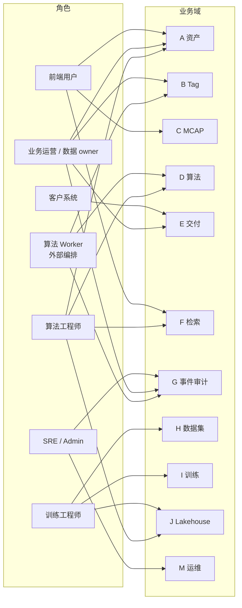
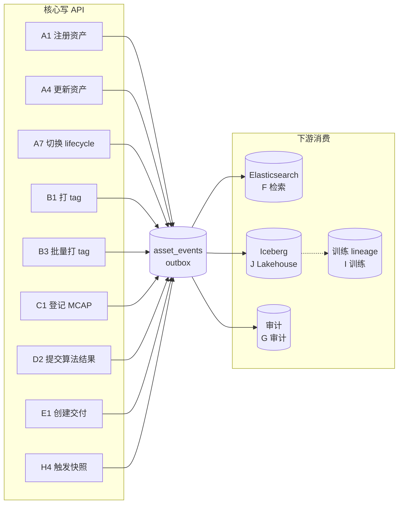

# Use Cases 清单

> 平台 2.0 目标态需要支持的全部用户场景。按业务域分组，每条标角色 + API + 关键约束。
> 设计上下文与 6 个代表性场景叙述见 `data-platform-design.md` §5.8.2；架构 / 数据流 / 事件契约见同文档其它章节。

## 文档分层与现行主路径（对接必读）

- **集成契约权威顺序**：`docs/review/api-guide.md` → `api/openapi.yaml` → `backend/routes/routes.go`。
- 本文件是 **全景用例矩阵**：同时收录 **已上线** 与 **目标态 / Phase 2+**。表格 **API** 列使用 **🟢** = 当前单进程已注册路由；**⚪** = 尚未在 `routes.go` 挂载（愿景或排期中）。
- **资产列表、关键字检索、复合筛选** 的正式入口为 **`POST /api/v1/queries/validate`** 与 **`POST /api/v1/queries/run`**（见 api-guide）。~~`GET /api/v1/assets?...`~~、~~`GET /api/v1/search`~~、~~`GET /api/v1/search/assets`~~ 已从主路径下线，勿在新集成中使用。

## 编号约定

- A 资产 / B Tag / C MCAP / D 算法 / E 交付 / F 检索 / G 事件审计 / H 数据集 / I 训练任务 / J Lakehouse / K SDK / L 前端组合页 / M 运维
- 同一编号下的子项按"用户动作"排，与开发任务可一一对应

## 全景视图

### 角色 × 业务域

### 核心写 API → 事件 → 下游消费

平台的跨域协作通过 `asset_events` outbox 串起来——下图展示哪些写 API 产事件、哪个域消费：

### Phase 上线节奏

```mermaid
flowchart LR
    subgraph P1[Phase 1 MVP<br>上线必备]
        P1A["A1/A3/A4/A5/A7/A10"]
        P1B["B1/B2/B4"]
        P1C["C1/C2/C4"]
        P1D["D1/D2/D3/D4/D7"]
        P1E["E1-E5"]
        P1G["G1/G2"]
        P1K["K1/K3/K5/K6"]
        P1L["L1/L2/L4/L8"]
        P1M["M1/M2"]
    end

    subgraph P15[Phase 1.5<br>上线后立刻补]
        P15A["A2/A6/A8/A9/A11"]
        P15BFGM["B3/B5/B6 · F1/F2/F4 · G3/G4 · M3/M5/M6/M7"]
        P15CDE["C3/C5/C6 · D5/D6/D8/D9 · E6/E7"]
    end

    subgraph P2[Phase 2<br>数据集 / 训练域上线]
        P2H["H1-H9"]
        P2I["I1-I5"]
        P2J["J1-J4"]
        P2KL["K2/K4 · L3/L5/L6/L7/L9 · M4"]
    end

    subgraph P3[Phase 3+<br>候选]
        P3F["F3 聚合 · F5 向量召回"]
    end

    P1 --> P15 --> P2 --> P3
```

---

## A. 资产（Asset）—— 平台一等公民

| # | 场景 | API | 角色 | 关键约束 |
|---|------|-----|------|---------|
| A1 | 注册新资产（数采链路完成后） | 🟢 `POST /api/v1/assets` | 系统 / 数据管道 | 写入同事务追加 `asset_created` 事件 |
| A2 | 批量导入资产（历史 / 离线作业） | ⚪ `POST /api/v1/assets:batch` | Admin / 数据工程 | **未上线**；单次 ≤ 1000 条；超出走 chunk |
| A3 | 资产详情（基础 + tags + algo 状态合并） | 🟢 `GET /api/v1/assets/{id}` | 全部 | PG 三表 fan-out；< 100 ms P99 |
| A4 | 部分更新资产（多字段 PATCH，含 lifecycle） | 🟢 `PATCH /api/v1/assets/{id}` | 业务 / 算法 | OCC：`If-Match: version`，冲突 `409` |
| A5 | 列表筛选 + 分页（工作台） | 🟢 `POST /api/v1/queries/run`（先 `queries/validate` 可选） | 全部 | **现行主路径**；structured / keyword；ES recall + PG refine；见 api-guide；~~`GET /assets?` 已下线~~ |
| A6 | 软删 / 归档资产 | 🟢 `DELETE /api/v1/assets/{id}` | Admin | 物理删除由后台 retention job 跑 |
| A7 | 生命周期切换（专用子资源） | ⚪ `PATCH /api/v1/assets/{id}/lifecycle` | 业务 | **未上线**；现行用 **A4** 更新 `lifecycle_state` |
| A8 | 还原归档资产 | ⚪ `POST /api/v1/assets/{id}:restore` | Admin | **未上线** |
| A9 | 查资产关联的 MCAP | ⚪ `GET /api/v1/assets/{id}/mcap` | 算法 / 业务 | **未上线**；可从 A3 详情字段读取关联 |
| A10 | 资产事件历史 / 时间线 | 🟢 `GET /api/v1/assets/{id}/events` | 业务 / 审计 | 按 `event_seq` 排，支持游标分页 |
| A11 | 资产血缘（父子 / 派生） | ⚪ `GET /api/v1/assets/{id}/lineage` | 训练 / 算法 | **未上线**；走 `asset_relations` 表（愿景） |

---

## B. Tag 管理

| # | 场景 | API | 角色 | 关键约束 |
|---|------|-----|------|---------|
| B1 | 给资产打 tag | 🟢 `POST /api/v1/assets/{id}/tags` | 业务 / 算法 | 校验 `tag_registry`：key + value 必须在白名单 |
| B2 | 删 tag | 🟢 `DELETE /api/v1/assets/{id}/tags/{key}` | 业务 | 同事务追加 `tag_deleted` 事件 |
| B3 | 批量打 tag | ⚪ `POST /api/v1/tags:bulk` | 业务 | **未上线**；单次 ≤ 500 资产（愿景） |
| B4 | 查 tag 注册表（key / values 枚举） | 🟢 `GET /api/v1/tag-registry` | 全部 | 来自 `tag_registry.yaml`，支持热重载 |
| B5 | 按 tag 反查资产 | 🟢 `POST /api/v1/queries/run`（where 过滤 tags） | 全部 | **替代** ~~`GET /assets?tags.*`~~；走 Query IR + ES/PG |
| B6 | tag 修改历史 | 🟢 `GET /api/v1/assets/{id}/tags/history` | 审计 | 走 `asset_events` 过滤 type |

---

## C. MCAP 文件（原始数采）

| # | 场景 | API | 角色 | 关键约束 |
|---|------|-----|------|---------|
| C1 | 登记 MCAP 元数据（写入文件记录） | 🟢 `POST /api/v1/mcap-files` | 数采链路 | `raw_hash_md5` UNIQUE，重复直接复用 |
| C2 | 查 MCAP 元数据 | 🟢 `GET /api/v1/mcap-files/{id}` | 全部 | 返回单文件当前态 |
| C3 | 列表 MCAP | 🟢 `GET /api/v1/mcap-files` | 业务 / Admin | 当前支持 `page/page_size/ingest_state/owner` |
| C4 | 上传完成回调（Finalize） | 🟢 `POST /api/v1/mcap/upload/finalize` | 数采链路 | 上传成功后写入 finalize 事件 |
| C5 | 读取 MCAP 消息（调试） | 🟢 `GET /api/v1/mcap/{id}/messages` | SDK / 算法 | 按消息流读取，不下载整文件 |

---

## D. 算法处理

**当前 v1 API（asset-scoped 主口径）：**

| # | 场景 | API | 角色 | 关键约束 |
|---|------|-----|------|---------|
| D2a | 启动算法 | 🟢 `POST /api/v1/assets/{id}/algo/{algo_key}/start` | 算法 worker | `pending → running`；同事务写 `asset_algo_latest` + 追加 `algo_started` 事件 |
| D2b | 完成算法 | 🟢 `POST /api/v1/assets/{id}/algo/{algo_key}/finish` | 算法 worker | ok/failed；同事务写投影 + 追加 `algo_finished` / `algo_failed` 事件；相同 `run_id` 重复幂等 |
| D2c | 重置算法 | 🟢 `POST /api/v1/assets/{id}/algo/{algo_key}/reset` | Admin / 算法 worker | 仅 ok/failed 可重置为 pending |
| D4 | 资产的所有算法状态 | 🟢 `GET /api/v1/assets/{id}/algo` | 业务 | 投影表读，毫秒级 |
| D7 | 算法注册表查询 | 🟢 `GET /api/v1/algo-registry` | 全部 | 来自 `algo_registry.yaml` |
| D8 | 算法依赖（depends_on） | ⚪ `GET /api/v1/algo/{name}/dependencies` | 算法 worker | **未上线**；现行读 `algo-registry` YAML |
| D9 | 标记算法状态 blocked | ⚪ `PATCH /api/v1/assets/{id}/algo/{name}` | Admin | **未上线** |

**目标态候选 API（worker convenience，未冻结）：**

| # | 场景 | API | 角色 | 关键约束 |
|---|------|-----|------|---------|
| D1 | 拉待处理资产（pending） | ⚪ `GET /api/v1/algo/{name}/pending?since=&limit=` | 算法 worker | **未上线**；候选替代：**A5** `queries/run` 过滤 algo 状态 |
| D3 | 查算法 run 详情 | ⚪ `GET /api/v1/algo/runs/{run_id}` | 全部 | **未上线** |
| D5 | 列某算法的所有 run | ⚪ `GET /api/v1/algo/{name}/runs?status=ok` | 算法 / Admin | **未上线** |
| D6 | 重跑算法 / 回放 | ⚪ `POST /api/v1/algo/{name}:replay` | Admin / 算法 | **未上线** |

---

## E. 交付（Delivery）

| # | 场景 | API | 角色 | 关键约束 |
|---|------|-----|------|---------|
| E1 | 创建交付 | 🟢 `POST /api/v1/deliveries` | 业务 | **必须带 `Idempotency-Key`** |
| E2 | 查交付详情 | 🟢 `GET /api/v1/deliveries/{id}` | 业务 | 含 SLA / 渠道 / 当前进度 |
| E3 | 列出交付 | 🟢 `GET /api/v1/deliveries` | 业务 | 按 owner / status / 时间过滤 |
| E4 | 列交付项明细 | 🟢 `GET /api/v1/deliveries/{id}/items` | 业务 | 大交付走分页 |
| E5 | 取消交付 | ⚪ `POST /api/v1/deliveries/{id}:cancel` | 业务 | **未上线** |
| E6 | 重试失败项 | ⚪ `POST /api/v1/deliveries/{id}:retry` | 业务 | **未上线** |
| E7 | 客户回执 | ⚪ `POST /api/v1/deliveries/{id}/ack` | 客户系统 | **未上线** |
| E8 | 按客户列交付 | 🟢 `GET /api/v1/customers/{customer_id}/deliveries` | 业务 | 分页参数见 api-guide |
| E9 | 资产被交付历史 | A3 详情已含 `last_delivered_to` 等 | 业务 | — |

---

## F. 检索 / 搜索（Query IR + Elasticsearch）

| # | 场景 | API | 角色 | 关键约束 |
|---|------|-----|------|---------|
| F0 | 工作台统一查询（结构化 / 关键字 / offset） | 🟢 `POST /api/v1/queries/validate` · 🟢 `POST /api/v1/queries/run` | 全部 | **现行主路径**；替代旧 `GET /search`、`GET /assets` 列表 |
| F-sync | 搜索索引对齐状态 | 🟢 `GET /api/v1/search/sync-status` | 运维 / 前端 | ES vs PG 对账提示 |
| F-re | 管理重建 ES 索引 | 🟢 `POST /api/v1/admin/search/reindex` | Admin | `dry_run` 等见 api-guide |
| F-saved | 保存的查询 CRUD | 🟢 `GET` / `POST` / `PATCH` / `DELETE /api/v1/saved-queries...` | 业务 / 前端 | 持久化 Query IR |
| F1 | 全文检索（旧 REST `q=`） | ⚪ `GET /api/v1/search?q=` | — | **未上线**；请用 `queries/run` `mode=keyword` |
| F2 | 多维 filter（旧 REST） | ⚪ `GET /api/v1/search?q=&filter=...` | — | **未上线**；请用 `queries/run` structured |
| F3 | 聚合统计（按 tag / lifecycle / owner） | ⚪ `GET /api/v1/search/agg?group_by=` | 看板 | **未上线**（2.x 候选） |
| F4 | 自动补全 / suggest | ⚪ `GET /api/v1/search/suggest?prefix=` | 前端搜索框 | **未上线** |
| F5 | 相似资产召回（向量，3.x 候选） | ⚪ `GET /api/v1/search/similar?asset_id=` | 算法 | **未上线** |

---

## G. 事件 / 审计 / 历史

| # | 场景 | API | 角色 | 关键约束 |
|---|------|-----|------|---------|
| G1 | 资产事件流（与 A10 同） | 🟢 `GET /api/v1/assets/{id}/events` | 业务 / 审计 | 按 `event_seq` 范围 |
| G2 | 全局事件流（按 seq 拉取） | ⚪ `GET /api/v1/events?from_seq=` | Admin / 下游 | **未上线** |
| G3 | 审计查询 | ⚪ `GET /api/v1/audit?actor=&action=` | 合规 / Admin | **未上线** |
| G4 | 重放事件区间 | ⚪ `POST /api/v1/events:replay` | Admin / SRE | **未上线** |

---

## H. 数据集 / Dataset（训练数据治理）

| # | 场景 | API | 角色 | 关键约束 |
|---|------|-----|------|---------|
| H1–H9 | 数据集 / 快照 / 预览 / 归档 | ⚪ `/api/v1/datasets...` 全套 | 训练工程师 | **Phase 2+，未上线** |

---

## I. 训练任务记录（Training Runs）

| # | 场景 | API | 角色 | 关键约束 |
|---|------|-----|------|---------|
| I1–I5 | 训练任务注册 / 查询 | ⚪ `/api/v1/training-runs...` | 训练系统 | **Phase 2+，未上线** |

---

## J. Lakehouse / OLAP（BigQuery + Iceberg）

| # | 场景 | API | 角色 | 关键约束 |
|---|------|-----|------|---------|
| J0 | 报表 / 状态 / 表清单 / 同步态 / 训练资产 / 重算候选 / tag 时间线 / 质量分布 / 客户回放 | 🟢 `GET /api/v1/lakehouse/report` · `status` · `tables` · `sync-status` · `training-assets` · `recompute-candidates` · `tag-timeline` · `quality-distribution` · `customer-replay` | 业务 / 数据分析 | 详见 api-guide |
| J1 | 受限 SQL 自助查询 | ⚪ `POST /api/v1/lakehouse/query` | 业务 / 数据分析 | **未上线** |
| J2 | 重算候选清单（一行封装） | 🟢 `GET /api/v1/lakehouse/recompute-candidates` | 算法 | 跑 BigQuery SQL，结果缓存 |
| J3 | 跨字段聚合（专用报表端点） | ⚪ `GET /api/v1/lakehouse/agg?...` | 看板 | **未上线**；部分指标由 J0 覆盖 |
| J4 | 表 schema 查询 | ⚪ `GET /api/v1/lakehouse/tables/{name}/schema` | SDK / 训练 | **未上线** |

---

## K. Python SDK（grace_sdk）

| # | 场景 | SDK API | 内部走 | 说明 |
|---|------|--------|------|------|
| K1 | 拿单资产 | `asset.get(id)` | A3 | 一行返回 dataclass |
| K2 | 流式读 MCAP topic | `asset.stream(topic, asset_id)` | C4 + GCS Range | 不下整文件 |
| K3 | 列资产（生成器，自动分页） | `asset.list(filter=, iter=True)` | **A5（queries/run）** | SDK 应封装 `POST /api/v1/queries/run`，而非旧 REST 列表 |
| K4 | 流式拉训练数据 | `dataset.iter(snapshot_id=)` | PyIceberg 直读 | 不经 backend |
| K5 | 给资产打 tag | `asset.tag(id, key, value)` | B1 | — |
| K6 | 提交算法结果 | `algo.complete(asset_id, name, result)` | D2 | Worker 友好包装 |

---

## K2. Eval / Metrics（REST）

| # | 场景 | API | 角色 | 关键约束 |
|---|------|-----|------|---------|
| Ev1 | 上报评估结果 | 🟢 `POST /api/v1/assets/{id}/eval-results` | 评估流水线 | 见 `eval-metrics-design.md` / api-guide |
| Ev2 | 列评估历史 | 🟢 `GET /api/v1/assets/{id}/eval-results` | 业务 / 质检 | — |
| Ev3 | 读指标投影 | 🟢 `GET /api/v1/assets/{id}/metrics` | 业务 / 看板 | — |
| Ev4 | 指标注册表 | 🟢 `GET /api/v1/metrics/registry` | 全部 | 白名单 |
| Ev5 | 按指标检索资产 | 🟢 `POST /api/v1/metrics:search` | 业务 / 算法 | PG / ES 路径见实现 |

---

## L. 前端组合页面（多 API 拼接）

| # | 页面 | 拼接的 API |
|---|------|----------|
| L1 | 工作台首页（资产 + run + 交付 + 趋势） | **A5（queries/run）** + E3 + J0 |
| L2 | 资产详情页（基础 + tags + algo + events + lineage + MCAP） | A3 + A10 + **⚪ A11/A9（未上线）** + C2 |
| L3 | 算法监控页 | **⚪ D5（未上线）** + J0 |
| L4 | 交付管理页 | E1–E4（E5–E7 ⚪） |
| L5 | 数据集管理页 | **⚪ H1–H9（Phase 2）** |
| L6 | 训练任务监控页 | **⚪ I3+I4（Phase 2）** |
| L7 | 搜索页（工作台查询） | **F0（queries/run）** + F-sync |
| L8 | MCAP 在线预览（嵌入 Webviz / Foxglove） | C4 + C2 |
| L9 | 审计追踪页 | G1 + **⚪ G3** |

---

## M. 运维 / Admin / 系统层

| # | 场景 | API | 角色 |
|---|------|-----|------|
| M1 | 健康检查 | 🟢 `GET /healthz` | K8s |
| M2 | Prometheus 指标 | 🟢 `GET /metrics` | GMP |
| M3 | 强制重建 ES 索引 | 🟢 `POST /api/v1/admin/search/reindex` | SRE |
| M4 | 触发 PyIceberg MERGE（手动） | ⚪ `POST /admin/lakehouse/merge` | SRE |
| M5 | 重置 outbox watermark / DLQ 处理 | ⚪ `POST /admin/outbox/{sink}/watermark` | SRE |
| M6 | 查 outbox queue 状态 | ⚪ `GET /admin/outbox/status` | SRE |
| M7 | tag / algo 注册表热重载 | ⚪ `POST /admin/registry:reload` | Admin |

> 说明：⚪ Admin 路径未列在 `routes.go` 当前摘要表中；以实际进程为准。

---

## 角色 → 主要场景速查

| 角色 | 主要场景 |
|------|---------|
| 算法工程师 | A3 / **A5（queries/run）** / D2 / D4 / **Ev5** / J0 / K1–K6 |
| 算法 Worker（自动化） | D2 / D7 / B1 / **A5（queries/run 拉 pending）** |
| 业务运营 / 数据 owner | A1 / A4 / **A5** / B1 / B5 / E1–E4 / G1 |
| 训练工程师 | **⚪ H/I（Phase 2）** / J0 / K4 |
| 客户系统 | **⚪ E7**（未上线） |
| Admin / SRE | A6 / **⚪ D6** / **M3** / M1–M2 |
| 前端用户 | A3 / **A5** / **F0** / L1–L9 |

---

## 开发优先级建议

> 仅作 MVP 范围参考，最终由产品 / 工程联合排期。下列编号引用本节上方矩阵；**已上线**以 🟢 为准。

### Phase 1 MVP（必备，上线前）

🟢 A1 / A3 / A4 / **A5（queries/run）** / A6 / A10  
🟢 B1 / B2 / B4 / B5 / B6  
🟢 C1 / C2 / C4 / C5  
🟢 D2a–D2c / D4 / D7  
🟢 E1 / E2 / E3 / E4 / **E8（customers/deliveries）**  
🟢 G1（同 A10）  
🟢 **F0 / F-sync / F-re**  
🟢 **Ev1–Ev5**  
🟢 K1 / K3 / K5 / K6  
🟢 L1 / L2 / L4 / L8  
🟢 M1 / M2 / M3  

### Phase 1.5（上线后立刻补）

⚪ A2 / A7–A9 / A11  
⚪ B3  
⚪ **⚪ D1 / D3 / D5–D6 / D8–D9**  
⚪ E5–E7  
⚪ F3–F4  
⚪ G2–G4  
⚪ M4–M7  

### Phase 2（数据集 / 训练域上线时）

⚪ H1–H9 · ⚪ I1–I5 · ⚪ J1 / J3 / J4  
K2 / K4  
⚪ L3 / L5 / L6 / L9  
M4  

### Phase 3+（候选）

⚪ F3（聚合）/ ⚪ F5（向量召回）

---

## 维护规则

- 新增 API 端点必须先在本文件登记一行（编号 + 角色 + API + 关键约束），并标明 🟢/⚪
- API 退役时不删行，把"关键约束"列改为 `~~已废弃 vYY.MM~~`，保留 1 个版本周期后归档到附录
- 编号一旦分配不复用；废弃编号留作历史档案
- 与 `data-platform-design.md` §5.8.2 的 6 个代表场景同步——叙述变更要回写到本文件
- **列表/检索类**变更须同步 **`api-guide.md`**（`queries/run` 为现行主路径）
