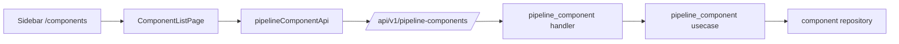

# Design — CYB-1254

## Architecture Context

- **Constraints**: React 18 + TypeScript + Ant Design 5 on the frontend; Go 1.25 + Gin backend; API requires `/api/v1` token/cookie auth and CSRF guard headers for mutating calls.
- **Goals**: expose component registry CRUD as a first-class page while keeping the existing pipeline canvas able to consume registered components.
- **Non-Goals**: rewrite the pipeline canvas, change Argo transpilation, or introduce a new database engine/persistence pattern.

## Affected Modules

- `backend/internal/handlers/pipeline_component` — validate and expose component CRUD.
- `backend/routes/routes.go` — register `pipeline-components` routes, preserving existing route compatibility if needed.
- `backend/internal/repository` / component storage implementation — confirm persistence supports required fields.
- `Frontend/src/api/pipelineComponentApi.ts` — typed API client aligned with backend response shape.
- `Frontend/src/pages/ComponentListPage.tsx` — standalone registry list and modal form.
- `Frontend/src/components/AppLayout.tsx` / `Frontend/src/App.tsx` — sidebar item and route.

## Existing Pipeline Integration Architecture

```
Frontend/src/
├── pages/
│   └── PipelinePage.tsx          # 主页面，3 个 tab 视图
├── components/pipeline/
│   ├── PipelineCanvas.tsx        # React Flow canvas（核心交互）
│   ├── PipelineNode.tsx          # 自定义 canvas node
│   ├── ComponentPalette.tsx      # 拖拽组件面板
│   ├── NodeConfigPanel.tsx       # 选中节点的配置面板
│   ├── ComponentManager.tsx      # 组件注册管理
│   └── DeployPanel.tsx           # 部署历史 / 模板管理
├── api/
│   └── pipelineApi.ts            # pipeline API 客户端
└── styles/
    └── pipeline.css              # React Flow & 管道画布样式
```

## 集成方式

### 路由

在 `App.tsx` 添加 `/pipeline` 路由，懒加载 `PipelinePage`。

### 布局

PipelinePage 使用 antd Tabs 组件替代原来的 tab nav，在内容区展示：
- **Pipeline** — 三栏布局：Palette | Canvas | ConfigPanel
- **Registry** — ComponentManager 组件
- **Deploy** — 部署历史与模板管理

### 依赖

新增 `@xyflow/react` 到 Frontend/package.json。

### 菜单

AppLayout.tsx 中 `/pipeline` 改为内部导航（`navigate("/pipeline")`），移除外部 URL 跳转。

## 样式策略

- React Flow canvas 的节点样式保持原有自定义 CSS（`pipeline.css`）
- 按钮、表单、Modal 等改用 antd 组件
- 复用主应用的 design-tokens（色板、字体、间距）

## 状态

- PipelinePage 内部 useState/useCallback 管理本地状态
- Component Registry 暂存 localStorage（与原有行为一致）
- 部署列表通过 API 获取

## 兼容性

- 不影响现有页面和路由
- `/pipeline` 在原 AppLayout 中已有菜单项，只需改导航方式
- 原有 standalone 的 `databrew-pipeline/ui/` 目录保留在 repo 中（不删除）

## Architecture Decisions

### Decision 1: Standalone registry page uses the backend API as source of truth
- **Approach**: `ComponentListPage` fetches, filters, creates, updates, and deletes components through `pipelineComponentApi`.
- **Alternative**: continue using the embedded `ComponentManager` local state inside `/pipeline`.
- **Rationale**: users need an admin-style registry that survives page reloads and is accessible without opening the canvas.
- **Trade-off**: the page must handle backend loading/error states instead of being purely local.

### Decision 2: Support `pipeline-components` while preserving existing `components`
- **Approach**: add or alias `/api/v1/pipeline-components` CRUD routes to the existing pipeline component handler, and update the frontend client to the task-required path once verified.
- **Alternative**: keep only `/api/v1/components`.
- **Rationale**: `TASK.md` explicitly specifies `pipeline-components`, while existing code and canvas integration use `/components`; compatibility avoids breaking current users.
- **Rollback**: remove the alias route and switch frontend client back to `/components` if the API contract review rejects the new path.

### Decision 3: Represent command/args/env as structured form lists
- **Approach**: use Ant Design `Form.List` for string arrays and key-value env pairs; serialize to the backend model fields (`resources.command`, `resources.args`, `envVars`) if the model remains unchanged.
- **Alternative**: accept raw JSON text inputs.
- **Rationale**: structured controls reduce invalid payloads and match the requested modal behavior.
- **Risk**: existing backend model lacks first-class `type`, `command`, and `args` fields; implementation must either map them consistently or add contract fields with synchronized docs/tests.

## Data Flow



## Data Model Changes

- **Table**: pipeline component persistence, if already present
- **Change**: prefer no schema migration; map `type`, `command`, and `args` through existing JSON/resource fields if feasible
- **Migration**: only add a migration if existing storage cannot persist required fields without lossy conversion

## Risks / Trade-offs

| 风险 | 影响 | 缓解措施 |
|------|------|----------|
| Existing `/components` API shape differs from required `/pipeline-components` path | Frontend/backend mismatch | Define OpenAPI and TS types before handler changes |
| System components may be deleted accidentally | Broken default canvas palette | Handler/usecase should prevent deleting protected system components if current model marks source as system |
| Env/args mapping may be inconsistent between canvas and registry page | Created components may not deploy correctly | Share API conversion helpers or keep field mapping in one client module |
