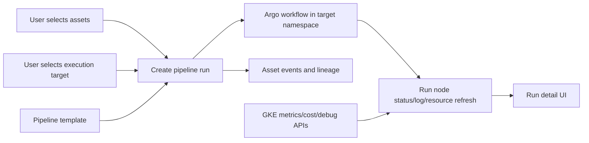

# Design — CYB-1532

## Architecture Context
- **Constraints**: DataBrew uses Go, Postgres, React, and Argo Workflows. Current pipeline submission uses a backend-configured Argo namespace and persists `pipeline_deployments`.
- **Goals**: make asset-driven execution the default product flow, expose execution target selection, and preserve current deployment compatibility while introducing the run model.
- **Non-Goals**: build a new scheduler, manage Kubernetes credentials in the browser, or remove Argo.

## Affected Modules
- `backend/internal/usecase/pipeline` — create run semantics, validate assets and targets, submit to Argo, and refresh node state.
- `backend/internal/handlers/pipeline` — expose run and execution-target endpoints with API contract sync.
- `backend/internal/repository` — persist execution targets and run metadata if implementation approval includes migrations.
- `Frontend/src/components/pipeline` — separate component library, template CRUD, run submission, and execution monitoring.
- `Frontend/src/pages/PipelinePage.tsx` — route tabs to product-specific work surfaces instead of one overloaded panel.

## Product Model
- **Component Library**: user-managed reusable step definitions, including image, command, args, resources, env, ports, and runtime output contract.
- **Pipeline Template**: user-managed DAG of components and connections. This is CRUD for "what should run".
- **Execution Target**: cluster, namespace, Argo endpoint reference, service account, default resource policy, quota policy, and labels. This is "where it runs".
- **Pipeline Run**: one submission of a template or ad-hoc pipeline against an execution target and optional asset batch. This is "this run".
- **Pipeline Run Node**: the observed state for one run node, including Argo node ID, pod name, host, phase, timestamps, log pointer, resource duration, and message.
- **Pipeline Run Asset Node**: the future normalized view of asset x node state for batch processing. The MVP can derive this from run assets and Argo node state until per-asset fan-out exists.
- **Pod Debug Workbench**: the run-node detail surface for GKE Pod diagnosis. It groups logs, Pod describe/events, metrics, cost, and controlled exec commands behind backend-mediated APIs.

## Architecture Decisions

### Decision 1: Introduce execution targets before full multi-cluster scheduling
- **Approach**: add a target model that initially maps to the existing `cyber-databrew-dev` namespace and Argo backend configuration.
- **Alternative**: keep namespace as a single environment variable until multiple clusters are needed.
- **Rationale**: users already need to know where a run will execute, and later cluster/namespace support should not require reworking the run API.
- **Trade-off**: the first target record may be mostly configuration metadata, not a full scheduler.
- **Rollback**: keep existing `/deploy` and `/deploy/template/:id` behavior while the new run endpoints are introduced.

### Decision 2: Use pipeline runs as the user-facing model, keep deployments as compatibility
- **Approach**: add `pipeline_runs` semantics in API/UI and map existing `pipeline_deployments` fields where possible.
- **Alternative**: rename existing deployments everywhere in one large migration.
- **Rationale**: "deployment" reads like infrastructure; users are monitoring runs. Compatibility reduces blast radius.
- **Risk**: two names may exist temporarily in code and docs.
- **Rollback**: continue rendering deployments if run endpoints are unavailable.

### Decision 3: Make asset selection explicit in every run path
- **Approach**: run modal shows asset selection, no-asset run option, and execution target together.
- **Alternative**: keep the primary "运行" button as immediate submit and hide asset selection in a dropdown.
- **Rationale**: current UI makes it too easy to run without assets and then wonder why no asset context appears.
- **Trade-off**: one extra click for quick no-asset debug runs.

### Decision 4: Validate component output contract at authoring and run time
- **Approach**: component editor and run preview explain required output behavior and warn when a step declares outputs but has no contract hint.
- **Alternative**: let Argo fail and rely on logs.
- **Rationale**: testing showed a command can print success but the workflow still fails because `/tmp/outputs/output` is missing.
- **Risk**: static validation cannot prove arbitrary commands write the file.

### Decision 5: Keep GCP/GKE observability behind DataBrew backend APIs
- **Approach**: the frontend reserves tabs and TypeScript shapes for Pod logs, Pod describe/events, monitoring, billing, and exec. Browser clients never receive kubeconfig or call the Kubernetes API directly.
- **GCP/GKE fit**: metrics should be sourced from GKE-compatible backends such as Cloud Monitoring, Managed Service for Prometheus, metrics-server, or Prometheus service proxy. Cost should prefer OpenCost allocation data and may enrich with GCP pricing/billing metadata.
- **Exec policy**: Pod exec requires a backend WebSocket proxy with RBAC, audit events, timeout, target allow-list, and cluster/namespace isolation before UI buttons are enabled.
- **Rationale**: DataBrew users need debugging without becoming cluster admins, and multi-cluster support must remain governed by execution targets.

## Data Flow

## Data Model Changes
- **Table**: `execution_targets`
- **Change**: store execution target metadata for cluster, namespace, Argo endpoint reference, service account, defaults, and status.
- **Migration**: required if runtime implementation proceeds; `backend/migrations/` requires explicit user approval before editing.

- **Table**: `pipeline_runs`
- **Change**: store user-facing run identity, template snapshot, selected asset IDs, target ID, workflow name, status, and timestamps.
- **Migration**: required if runtime implementation proceeds.

- **Table**: `pipeline_run_nodes`
- **Change**: store node-level observed state, pod/resource/log metadata, and timestamps.
- **Migration**: required if runtime implementation proceeds.

## Risks / Trade-offs

| Risk | Impact | Mitigation |
|------|--------|------------|
| Full per asset x node persistence is larger than the MVP | Could delay usable UX | Start with run + node state, keep schema/API shape compatible with asset x node expansion |
| Argo node data is eventually consistent | UI may show Pending briefly after success | Refresh active runs and expose last updated time |
| Component commands are arbitrary shell | Static validation has limits | Show contract hints and catch common missing-output failures in run detail |
| New endpoints require contract sync | More files touched | Update OpenAPI, API guide, SDK where public, smoke scripts, and frontend API in same PR |
