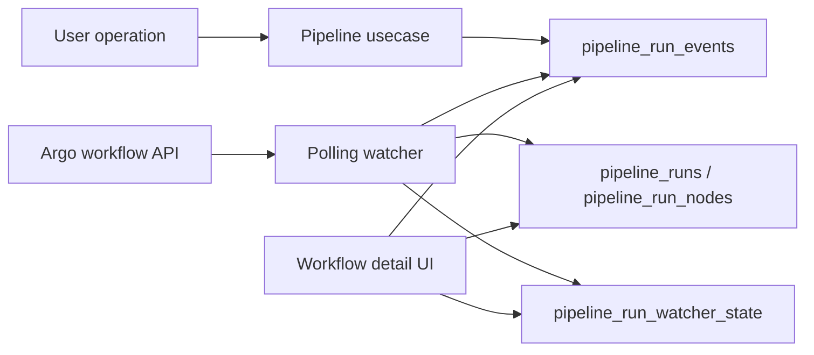

# Design — CYB-1568

## Architecture Context
- **Constraints**: Argo Workflow CRDs are operational objects and may be cleaned by TTL; DataBrew Postgres is the durable product ledger.
- **Goals**: Make DataBrew run history durable, debuggable, and observable without blocking on a full Argo watch-stream migration.
- **Non-Goals**: This change does not implement pod exec, exact billing, or multi-cluster target management.

## Affected Modules
- `backend/internal/models/pipeline.go` — watcher health fields and stable event payloads.
- `backend/migrations/` — extend watcher state and add supporting indexes.
- `backend/internal/postgres/pipeline_repo.go` — watcher status persistence and event filtering.
- `backend/internal/usecase/pipeline/usecase.go` — lifecycle event generation, retry/repair logic, and DataBrew-first run reconciliation.
- `backend/internal/handlers/pipeline/handler.go` — watcher status endpoint and event query handling.
- `Frontend/src/api/pipelineApi.ts` — typed watcher status and event types.
- `Frontend/src/pages/WorkflowDetailPage.tsx` / `WorkflowExecutionList.tsx` — timeline copy and watcher health surface.

## Architecture Decisions

### Decision 1: Keep polling, harden state and repair
- **Approach**: Keep `SyncActiveRunEvents` as the default watcher loop, but persist richer state: `last_scan_started_at`, `last_scan_finished_at`, `last_success_at`, `last_error_at`, `last_error`, `consecutive_failures`, `total_scans`, `total_errors`, `last_synced_run_count`, and `scan_lag_seconds`.
- **Alternative**: Replace with Argo watch stream immediately.
- **Rationale**: Polling is already deployed and sufficient for the next product slice. Watch stream can be a later performance/latency improvement.
- **Trade-off**: Polling can still miss transient intermediate states.
- **Mitigation**: Repair recently terminal runs and record current observed state idempotently.

### Decision 2: Treat DataBrew ledger as product truth
- **Approach**: Store workflow/node/pod lifecycle facts in `pipeline_run_events` and snapshots in `pipeline_runs` / `pipeline_run_nodes` / `pipeline_run_asset_nodes`.
- **Alternative**: Continue rendering mostly from current Argo workflow detail.
- **Rationale**: Argo objects expire; product history cannot disappear with CRD cleanup.
- **Risk**: Ledger may be stale if watcher fails.
- **Mitigation**: Expose watcher health and stale-state messaging in UI.

### Decision 3: Use idempotency keys for all lifecycle events
- **Approach**: Every generated event uses a deterministic idempotency key from run/workflow/node/pod identity and lifecycle timestamp/phase.
- **Alternative**: Allow duplicate events and de-duplicate in UI.
- **Rationale**: Watcher retries and repair scans must be safe.

### Decision 4: Record user-initiated operations before side effects
- **Approach**: Append retry/delete/resubmit events before calling Argo delete or creating the replacement run.
- **Alternative**: Record only after side effects succeed.
- **Rationale**: Audit trail should capture intent even if downstream systems fail.
- **Trade-off**: Some events may show attempted operations that failed later.
- **Mitigation**: Add payload/status fields for operation result when available.

## Data Flow

## Data Model Changes

- **Table**: `pipeline_run_watcher_state`
- **Change**: add scan health fields:
  - `last_scan_started_at`
  - `last_scan_finished_at`
  - `last_success_at`
  - `last_error_at`
  - `consecutive_failures`
  - `total_scans`
  - `total_errors`
  - `last_synced_run_count`
  - `scan_lag_seconds`
- **Table**: `pipeline_run_events`
- **Change**: add optional indexes for filtering by `run_id`, `event_type`, `subject_type`, `status`, and `occurred_at` if current query plan needs it.
- **Migration**: new numbered migration under `backend/migrations/`.

## Event Taxonomy

Initial stable event types:

- `run_submitted`
- `run_scheduled`
- `workflow_created`
- `workflow_observed`
- `workflow_phase_changed`
- `pod_created`
- `pod_phase_changed`
- `node_started`
- `node_succeeded`
- `node_failed`
- `node_error`
- `run_completed`
- `run_failed`
- `run_retry_requested`
- `run_resubmitted`
- `run_delete_requested`
- `run_deleted`
- `run_delete_failed`

## Risks / Trade-offs

| Risk | Impact | Mitigation |
|------|--------|------------|
| Watcher misses intermediate states | Timeline may skip short-lived transitions | Persist current facts idempotently; later add Argo watch stream |
| More events increase table size | Query and storage growth | Pagination, indexes, retention policy in later issue |
| Operation intent recorded before failed side effect | Audit may show attempted action | Add result event/status and payload error |
| UI over-exposes technical event names | Poor UX | Translate event types into business labels and keep raw details secondary |
