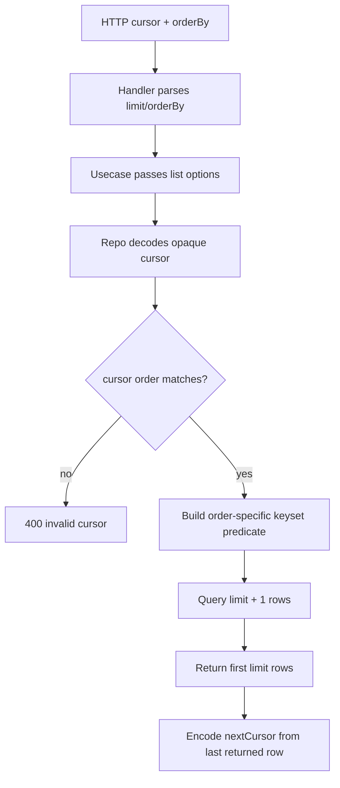

# Design — CYB-1797 Pipeline run asset-node cursors

## Architecture Context
- Backend is Go with Gin handlers and PostgreSQL repositories.
- Pipeline run asset-node data is stored in `pipeline_run_asset_nodes`.
- The public surface is the existing pipeline run asset-node listing endpoint.
- No database schema change is expected.

## Goals
- Preserve current sort modes.
- Make cursor filtering match the active sort order.
- Keep cursor values opaque to clients.
- Add tests for cursor correctness across sort modes.

## Non-Goals
- Reworking pipeline run observability persistence.
- Adding new sort modes.
- Changing frontend presentation.

## Affected Modules
- `backend/internal/handlers/pipeline/handler.go`
- `backend/internal/postgres/pipeline_repo.go`
- `backend/internal/models/pipeline.go`
- `backend/internal/postgres/*pipeline*_test.go` or equivalent repository tests
- `api/openapi.yaml`
- `docs/review/api-guide.md`

## Approach
Encode `nextCursor` as an opaque base64url JSON payload containing:
- cursor version
- active order mode
- last returned row ID
- the active order's primary sort values

Each order mode appends `id ASC` as a deterministic tie-breaker and uses a matching keyset predicate:
- default: `(asset_id, pipeline_node_id, id)`
- cost: `(estimated_cost_usd DESC NULLS LAST, asset_id ASC, id ASC)`
- duration: `(finished_at - started_at DESC NULLS LAST, asset_id ASC, id ASC)`
- status: `(status ASC, asset_id ASC, id ASC)`

The repository decodes the cursor, verifies the embedded order matches the requested `orderBy`, and rejects mismatches as invalid arguments. The handler maps that error to `400 INVALID_ARGUMENT`.

## Alternatives
### Alternative: Force `ORDER BY id ASC`
This is simpler and fixes correctness quickly, but it removes useful business ordering from paginated views.

### Alternative: Offset pagination
Offset avoids cursor encoding complexity but is unstable under concurrent updates and becomes slower for deeper pages.

## Rationale
Opaque composite cursors align filtering with the active sort while keeping the client contract simple. Appending `id ASC` provides deterministic ordering when business fields tie.

## Rollback
Rollback is code-only. Revert repository cursor parsing and handler error mapping. Existing clients that do not send a cursor continue to work.

## Risks
- Existing clients may hold old plain-ID cursors. The implementation should either reject them with a clear `400` or provide a temporary compatibility path for default ordering only.
- Nullable cost and duration values need explicit SQL ordering and cursor comparison semantics.
