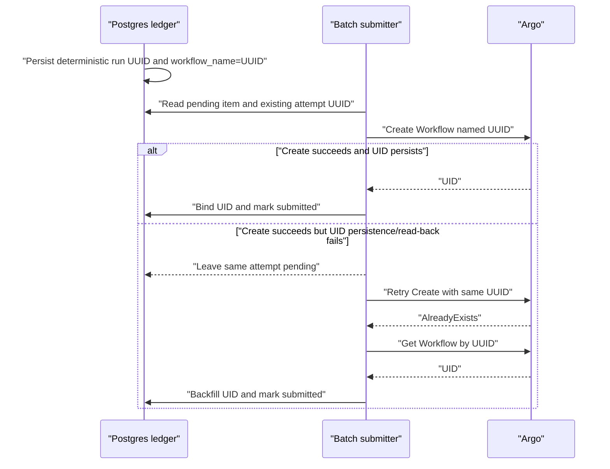

# Design — CYB-3906

## Architecture Context

- **Constraints**:
  - CYB-3076 requires the Argo workflow name to equal the run UUID so a pod
    name maps directly to `/runs/<id>`.
  - Submission correctness must not depend solely on the per-cluster advisory
    lock; lock errors intentionally fail open.
  - No transaction or row lock may remain open across the Argo API call.
  - Existing UID-bearing and terminal historical runs must remain readable.
- **Goals**:
  - One stable identity per logical batch item attempt.
  - Idempotent convergence after process failure, delayed UID visibility, or
    overlapping submitter cycles.
  - No new schema, public API, or dependency.
- **Non-Goals**:
  - Redesigning operator-initiated rerun behavior.
  - Solving unrelated dispatcher findings.

## Affected Modules

- `backend/internal/usecase/pipeline/batch_subtask.go` — create and persist the
  canonical attempt identity and normalize UID-less legacy placeholders.
- `backend/internal/usecase/pipeline/usecase.go` — keep Argo submission and
  refresh aligned to the canonical UUID identity.
- `backend/internal/usecase/backfill/submitter.go` — reuse automatic attempts
  instead of treating every UID-less placeholder as stale.
- `backend/internal/usecase/backfill/*_test.go` and
  `backend/internal/usecase/pipeline/*_test.go` — exercise production identity
  behavior rather than fake business workflow names.

## Architecture Decisions

### Decision 1: Run UUID is the canonical workflow identity

- **Approach**: Persist `workflow_name = runID` for a new batch subtask
  placeholder. Pass the same preallocated run ID through Deploy, item linkage,
  AlreadyExists refresh, watcher lookup, and final ledger binding.
- **Alternative**: Change Deploy to submit the existing
  `<pipeline>-batch-...` business name.
- **Rationale**: Deploy already uses the run UUID and CYB-3076 relies on that
  invariant for pod-to-run routing. Making the placeholder match the runtime
  is smaller and safer than reverting runtime naming.
- **Trade-off**: Placeholder detection can no longer depend on the `-batch-`
  substring and must use structural fields.

### Decision 2: Initial attempt IDs are deterministic per job and asset

- **Approach**: When no run exists and `ForceNewAttempt` is false, derive the
  run UUID deterministically from the full `(batchJobID, assetID)` key using
  the repository's existing UUID library. Concurrent upserts therefore target
  the same primary key and the same Argo workflow name.
- **Alternative**: Keep random UUID creation and rely on the cycle advisory
  lock.
- **Rationale**: The advisory lock intentionally fails open and does not cover
  every recovery/materialization interleaving. Correctness needs an identity
  that converges independently of that lock.
- **Trade-off**: The initial UUID is stable and predictable from internal IDs,
  but remains opaque and RFC1123-safe.

### Decision 3: Automatic recovery never creates a new attempt

- **Approach**: A UID-less non-terminal placeholder is deployable, not stale.
  The submitter reuses its run ID. A linked terminal attempt is projected or
  skipped according to its terminal state; it is not automatically redeployed.
  `ForceNewAttempt` remains reserved for explicit operator rerun paths.
- **Alternative**: Continue generating a new run whenever a placeholder has no
  UID or start time.
- **Rationale**: A missing UID can mean the Argo create succeeded but the
  persistence/read-back step failed. Changing the name in that window converts
  a safe AlreadyExists retry into duplicate execution.

### Decision 4: Placeholder detection is structural

- **Approach**: Identify a pending batch placeholder by batch linkage,
  non-terminal status, and empty Argo UID rather than by `workflow_name`
  containing `-batch-`. Normalize legacy UID-less business-name placeholders
  to their run UUID before submission.
- **Alternative**: Preserve the name marker and teach Deploy about a second
  workflow identity.
- **Rationale**: A ledger row's lifecycle fields are authoritative; a display
  naming convention is not a safe state discriminator.
- **Rollback**: Revert the normalization and submitter changes together. No
  data rollback is required because UUID workflow names are already the
  production runtime convention.

## Data Flow

## Data Model Changes

- None. Existing `pipeline_runs.id`, `workflow_name`,
  `argo_workflow_uid`, `batch_job_id`, and `backfill_items.pipeline_run_id`
  fields are sufficient.

## Risks / Trade-offs

| Risk | Impact | Mitigation |
|------|--------|------------|
| Legacy code expects `-batch-` in placeholder names | Incorrect awaiting-deploy messaging or stale recovery | Replace marker checks with structural predicates and add compatibility tests |
| Deterministic IDs collide due to truncated input | Two logical items share an attempt | Hash the full job and asset IDs, never truncated display suffixes |
| Concurrent `Save` calls race | One caller observes a transient persistence error | Upsert the same deterministic primary key and re-read the canonical row where needed |
| Terminal legacy item is pending | Accidental automatic rerun | Explicitly prohibit submitter-side `ForceNewAttempt`; require operator rerun |
