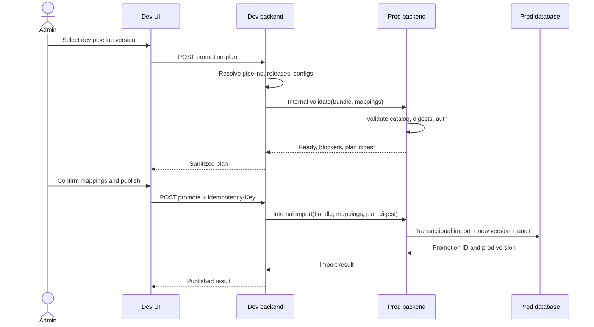

# Design: Dev-to-prod pipeline promotion

## Context

Dev and prod are separate deployments with fixed backend addresses and separate databases/resource catalogs. The current promote implementation creates another template in the same database, the backend pipeline JSON normalization drops frontend release-reference fields, and prod pipeline writes are globally locked. Component releases already contain digest-pinned immutable runtime snapshots, while Secret and storage references are environment identities that must not be copied.

## Goals

- Produce a reviewable, reproducible release from one dev pipeline version.
- Move portable component/configuration metadata while mapping environment-bound resources.
- Make prod the authority for validation, version allocation, idempotency, and audit.
- Permit admin correction through new versions without mutating historical versions.

## Non-goals

- General environment synchronization.
- Secret or infrastructure replication.
- Container registry replication.
- Redesigning the pipeline editor or authentication system broadly.

## Data flow

## Decisions

### 1. Dev coordinates; prod validates and imports

- **Approach**: The browser calls only the dev public API. The dev backend calls a fixed configured prod backend using dedicated service-to-service authentication. Prod exposes internal validate/import endpoints.
- **Alternative**: Let the browser call both environments with admin credentials.
- **Rationale**: Central coordination avoids distributing prod credentials, prevents client-selected target URLs, and makes prod validation authoritative.

Public source endpoints:

- `POST /api/v1/pipelines/{id}/promotion-plan`
- `POST /api/v1/pipelines/{id}/promote`, requiring `Idempotency-Key`

Internal target endpoints:

- `POST /api/v1/internal/pipeline-promotions/validate`
- `POST /api/v1/internal/pipeline-promotions/import`

The target is an enum (`prod`), not a URL supplied in a request. The HTTP client uses the configured HTTPS origin, rejects redirects, and applies timeouts and bounded payload sizes.

### 2. Classify dependencies as portable or environment-bound

- **Approach**: Copy normalized pipeline JSON, exact component release/runtime snapshot metadata, and explicitly safe pipeline config versions. Send only logical requirements for Secret, storage, and other environment-bound resources, then rewrite references to validated prod IDs.
- **Alternative**: Copy all referenced configuration and Kubernetes resource identifiers verbatim.
- **Rationale**: Resource IDs and credentials are environment-specific; copying them risks leaks and invalid deployments.

Suspicious plaintext environment/config keys (for example `TOKEN`, `PASSWORD`, `SECRET`, `KEY`, or `CREDENTIAL`) are blockers unless represented as a prod resource mapping. Secret values are never included in a bundle, log, audit row, or response.

### 3. Preserve exact component release identity

- **Approach**: Add `componentId`, `releaseId`, and `componentVersionLabel` to the Go pipeline component JSON model before normalization. A release-backed node resolves by release ID and verifies its digest. Legacy nodes may resolve only through one exact digest-pinned match.
- **Alternative**: Resolve by mutable component name/version label.
- **Rationale**: Names and labels can be reused; exact identity plus digest is required for reproducibility.

If the same target `(component_id, release_label)` exists with a different digest, prod returns `409` and never overwrites it. Zero or multiple legacy digest matches are blockers requiring admin correction.

### 4. Prod owns idempotency, audit, and version allocation

- **Approach**: Add a `pipeline_promotions` table with a unique idempotency key, bundle/plan digest, source and target identities, sanitized mappings/status/error, actor, and timestamps. The import transaction creates safe dependency rows, a new prod template version, and the completed audit record together.
- **Alternative**: Record status only in dev or rely on retries being rare.
- **Rationale**: Only prod can guarantee one target version and detect target-side partial failure.

Same key plus same bundle digest returns the prior result. Same key plus a different digest returns `409`. Prod assigns `GetNextVersion(name)`; the dev numeric version is recorded as provenance, not forced onto prod.

### 5. Images are referenced by digest, not copied

- **Approach**: Validate digest-pinned image references and prod pull readiness. The shared registry remains the artifact source.
- **Alternative**: Copy/retag images into a prod repository during every promotion.
- **Rationale**: Existing releases are already digest-pinned and both environments use the shared Artifact Registry. Binary replication adds latency and credentials without improving the initial workflow.

An inaccessible digest or missing prod node Artifact Registry permission is a promotion blocker.

### 6. Prod admin edits are append-only versions

- **Approach**: Implement the existing pipeline update endpoint as a real versioned save. Owners may version dev templates; only admins may version prod templates or change the active prod version. A `baseVersion` precondition detects stale edits.
- **Alternative**: Allow admins to mutate an existing prod row.
- **Rationale**: New versions satisfy the requested flexibility while preserving run and audit reproducibility.

Historical templates and runs are never rewritten. Non-admin prod edits return `403`; stale edits return `409`.

### 7. Dedicated service authentication

- **Approach**: Prefer Google-issued OIDC identity tokens from the dev service account, validated in prod for issuer, exact prod audience, and exact caller identity. If platform constraints block OIDC, use a dedicated promotion ingest Secret and the existing handler-local ingest-auth pattern, never the component release ingest token.
- **Alternative**: Trust the end-user admin JWT on the internal prod endpoint.
- **Rationale**: The current email-login path is not strong enough to establish cross-environment service identity, and Cloud Run is publicly invokable.

The admin authorization remains on the public dev endpoint; prod additionally authenticates the known dev service. Implementing auth must avoid `backend/internal/middleware/auth*`; if that becomes unavoidable, separate explicit off-limits approval is required.

### 8. Verification does not mutate real prod by default

- **Approach**: Exercise target validation against prod read-only state; exercise import transaction/idempotency in unit/integration tests and a disposable local/dev target. A real prod write is a separately approved operational check after deployment.
- **Alternative**: Use a real prod promotion as the standard dev smoke.
- **Rationale**: Routine feature verification must not create production versions or dependencies.

## Data model

Proposed `pipeline_promotions` fields:

- `id`, `idempotency_key` (unique), `bundle_digest`, `plan_digest`
- `source_environment`, `source_template_id`, `source_template_version`
- `target_template_id`, `target_template_version`
- `requested_by`, `status`, `sanitized_error`, `mappings` (JSONB)
- `created_at`, `updated_at`, `completed_at`

The migration is hand-written Atlas SQL and is not implemented until the user explicitly approves touching `backend/migrations/`.

## API behavior

The plan response includes `planDigest`, source identity, portable component/config entries, required mappings, warnings, blockers, and `ready`. The execute request includes the accepted `planDigest`, mappings, and optional note. Prod recomputes/verifies the bundle and mappings; a stale plan returns `409` and requires a new preview.

Errors use the existing API envelope and distinguish `400` invalid mapping, `401/403` authentication/authorization, `404` source dependency, `409` stale plan/idempotency or digest conflict, `422` target readiness blocker, and `502/504` target connectivity.

## UI

The existing deploy action opens a three-step admin flow:

1. Review the selected dev version and exact component/config dependencies.
2. Resolve required prod resource mappings and blockers.
3. Confirm, publish, and show promotion ID plus assigned prod version.

Prod cards remain view/run-only for ordinary users. Admins see Edit and Activate controls; save creates a new version and reuses the existing version-history/diff experience.

## Risks and mitigations

| Risk | Mitigation |
|---|---|
| Weak end-user email login is treated as proof of admin identity | Require admin role on dev and dedicated service identity at prod; track stronger admin authentication as a release/security prerequisite if current login remains forgeable |
| Secret-looking plaintext is copied in env/config | Classify and block suspicious keys; transfer references/mappings only; sanitize logs and audit |
| Old templates lack release references | Permit only unique digest-pinned fallback; otherwise block rather than guess |
| Component label collision overwrites a release | Return `409` on differing digest; never upsert over immutable history |
| Dev/prod resource catalogs drift | Preview against current prod catalog; revalidate plan digest at import |
| Prod cannot pull the image digest | Validate registry reachability/identity before import |
| Partial import creates unusable prod data | One prod transaction and target-owned idempotency record |
| Schema migration impacts an off-limits area | Pause for explicit approval, hand-write migration, hash/validate with Atlas, and require a second reviewer |

## Rollback

- Disable the fixed prod promotion target/auth binding and hide the UI action.
- Revert public routing/coordinator behavior to the previous same-environment implementation only if explicitly desired; the new internal importer remains unreachable without service auth.
- New prod versions and promotion audit rows are additive and remain available for investigation; rollback does not delete history.
- Activate the prior prod pipeline version when a newly promoted or admin-edited version is unsuitable.
- Schema rollback is forward-only: add a corrective migration rather than editing or deleting an applied migration.
